## 1.0 Overview

Raw LiDAR data arrives as massive unclassified point clouds (.xyz, .laz format) containing ground, vegetation, buildings, and noise. This chapter documents the preprocessing pipeline: catalog management, ground classification, noise removal, DTM generation, and height normalization. Output is analysis-ready normalized point clouds for tree detection.

The working example in this and subsequent chapters uses airborne lidar tile **10SGH1587** from the USGS 3DEP Lidar Point Cloud collection over the Carr / Hirz / Delta Fires burn scar in Shasta County, northern California. The data are Quality Level 1 linear-mode lidar (Project ID 224823, Horizontal EPSG 6339 NAD83(2011)/UTM 10N, Vertical EPSG 5703 NAVD88 with Geoid18), accepted for the 3DEP program with ≤ 9.8 cm absolute vertical accuracy at 95 % CI in open terrain. The tile covers 1 km × 1 km at ~78 pts/m² (78.3 million points) and is downloadable from the [USGS Staged Elevation FTP directory](https://rockyweb.usgs.gov/vdelivery/Datasets/Staged/Elevation/LPC/Projects/CA_CarrHirzDeltaFires_2019_B19/CA_CarrHirzDeltaFires_2_2019/). Figures below are built from a **1 ha clip** centred on the densest-canopy cell in the tile, which keeps every downstream chunk under a million points.

A full US government data-validation report for the project accompanies the tile at `assets/data/USGS_LPC_CA_SierraNevada_DataValidationReport.pdf`.

**Note**: Ground classification and DTM generation on large catalogs can require full-day processing times. Tiling configuration and indexing quality directly impact performance.

### Environment Setup

```{r setup}
#| warning: false
#| message: false
#| error: false
#| echo: true
pacman::p_load(
  "curl",
  "dplyr",
  "fontawesome",
  "htmltools",
  "kableExtra", "knitr",
  "lidR",
  "raster", "reproj",
  "sf",
  "terra", "tmap",
  "useful")
```

```{r}
#| warning: false
#| message: false
#| error: false
#| echo: false

knitr::opts_chunk$set(
  echo = TRUE,
  message = FALSE,
  warning = FALSE,
  error = TRUE,
  comment = NA)

sf::sf_use_s2(use_s2 = FALSE)
options(htmltools.dir.version = FALSE)
tmap_options(max.raster = c(plot = 9500000, view = 10000000))
```

```{css, echo=FALSE, class.source = 'foldable'}
div.column {
    display: inline-block;
    vertical-align: top;
    width: 50%;
}

#TOC::before {
  content: "";
  display: block;
  height:200px;
  width: 200px;
  background-image: url('../assets/PNG/las_tile_sierra_norm.png');
  background-size: contain;
  background-position: 50% 50%;
  padding-top: 80px !important;
  background-repeat: no-repeat;
}
```

------------------------------------------------------------------------

## 1.1 Catalog Management

`LAScatalog` handles datasets too large for memory by partitioning the data into chunks and processing them sequentially or in parallel. The Carr Fire tile is a single 1 km × 1 km LAZ; we index it, read a thinned scan of the whole tile, pick the 25 m cell with the tallest 95th-percentile canopy, and clip a 100 m × 100 m AOI around that centroid. This keeps every chunk below one million points without losing the tree-rich patch.

```{r import-catalog}
#| warning: false
#| message: false
#| error: false
#| echo: true
#| eval: false

src <- "../assets/data/USGS_LPC_CA_SierraNevada_B22_10SGH1587.laz"

ctg <- readLAScatalog(src, select = "xyzcr",
                     filter = "-thin_with_grid 0.5")
opt_chunk_size(ctg)   <- 500
opt_chunk_buffer(ctg) <- 10
is.indexed(ctg)
las_check(ctg)

# Coarse scan: 95p Z on a 25 m grid to locate the densest canopy
scan    <- readLAS(src, select = "xyz",
                   filter = "-keep_every_nth 20")
z95_grid <- pixel_metrics(scan, ~quantile(Z, .95, na.rm = TRUE),
                          res = 25)
pick <- which.max(terra::values(z95_grid))
xy   <- terra::xyFromCell(z95_grid, pick)
cx   <- xy[1, "x"]; cy <- xy[1, "y"]

las_raw <- clip_rectangle(ctg,
  cx - 50, cy - 50, cx + 50, cy + 50
)
```

**Key parameters**:

-   Buffer = 10 m minimises edge effects
-   Chunk size = 500 m works for the 1 km Carr tile
-   `-thin_with_grid 0.5` halves in-memory density for scans; the final clip is read at full density
-   For multi-tile catalogs add `opt_filter('-drop_class 19')` to remove overlapping points

::: {style="overflow: auto;"}
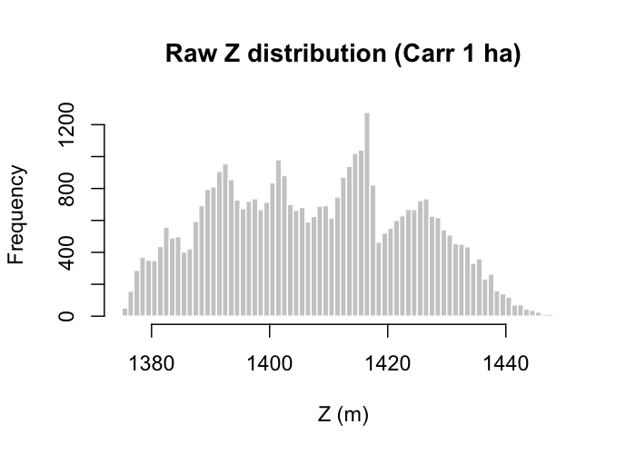{alt="Raw Z histogram" style="float: left; margin-right: 2%;" width="43.5%"} 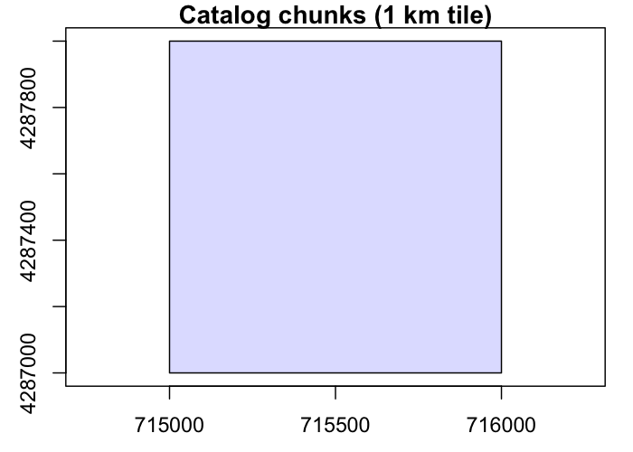{alt="Catalog chunks" style="float: left;" width="50.2%"}
:::

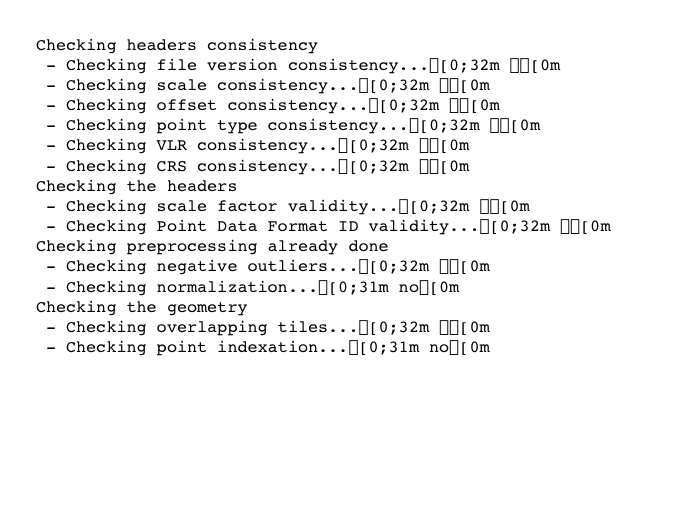{fig-align="center" width="95%"}

------------------------------------------------------------------------

## 1.2 Ground Classification

In this section we compare the Cloth Simulation Filter (`csf()`) with the Progressive Morphological Filter (`pmf()`). The CSF algorithm tends to produce a smoother DTM across variable topography [@zhang2016]. For the Carr tile — steep post-fire slopes with roughly 60 m of relief across the 1 ha AOI — CSF is visibly cleaner and is carried downstream.

```{r}
#| warning: false
#| message: false
#| error: false
#| echo: true
#| eval: false

library(RCSF)

# Apply CSF
las_csf <- classify_ground(las_raw, csf(sloop_smooth = TRUE, 0.5, 1))

# Apply PMF for comparison
las_pmf <- classify_ground(
  las_raw,
  pmf(ws = c(3, 6, 9), th = c(0.5, 1, 1.5))
)
```

::: {style="overflow: auto;"}
{alt="CSF ground" style="float: left; margin-right: 2%;" width="49%"} 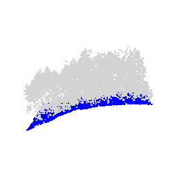{alt="PMF ground" style="float: left;" width="49%"}
:::

------------------------------------------------------------------------

## 1.3 Noise Removal

Once ground points are classified, any remaining noise is identified and removed to ensure data integrity. This process was carried out using the Statistical Outlier Removal (`sor`) algorithm with a default neighborhood sample of `k=10` and a multiplier of `m=3`.

The workflow considered four potential methods for noise screening:

1.  Using internal algorithms with the `filter_poi` function and a `LASNOISE` string.
2.  Filtering with `opt_filter` and the `-drop class 19` string.
3.  Screening by a Z-axis threshold (e.g., `Z > 40 & Z < 0`).
4.  Screening by the 95th percentile.

Using `filter_poi` with an internal algorithm was found to be slower in the long run due to loss of spatial indexing after a new catalog object was assigned.

```{r}
#| warning: false
#| message: false
#| error: false
#| echo: true
#| eval: false

las_csf_so  <- classify_noise(las_csf, sor(k = 10, m = 3))
las_csf_sor <- filter_poi(las_csf_so, Classification != LASNOISE)

las_pmf_so  <- classify_noise(las_pmf, sor(k = 10, m = 3))
las_pmf_sor <- filter_poi(las_pmf_so, Classification != LASNOISE)
```

::: {style="overflow: auto;"}
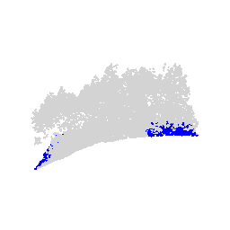{alt="Noise removal CSF" style="float: left; margin-right: 2%;" width="49%"} {alt="Noise removal PMF" style="float: left;" width="49%"}
:::

------------------------------------------------------------------------

## 1.4 Digital Terrain Model

Rasterisation is paramount to terrain analysis because it shapes every subsequent height-based estimate. The Inverse Distance Weighting (`knnidw`) algorithm is used here for its efficiency and robustness [@tu2020]. Parameters:

-   Default maximum radius of 50 m
-   Neighborhood of `10`
-   Inverse distance weighting power of `2`
-   Resolution of `0.5 m` (matches the 78 pts/m² density)

```{r}
#| warning: false
#| message: false
#| error: false
#| echo: true
#| eval: false

dtm_csf <- rasterize_terrain(las_csf_sor, res = 0.5,
                             knnidw(k = 10, p = 2, rmax = 50))
dtm_pmf <- rasterize_terrain(las_pmf_sor, res = 0.5,
                             knnidw(k = 10, p = 2, rmax = 50))

# Hillshade visualization
slope   <- terra::terrain(dtm_csf, "slope",  unit = "radians")
aspect  <- terra::terrain(dtm_csf, "aspect", unit = "radians")
hs      <- terra::shade(slope, aspect, angle = 40, direction = 270)
terra::plot(hs, col = grey(0:100/100), legend = FALSE)
```

::: {style="overflow: auto;"}
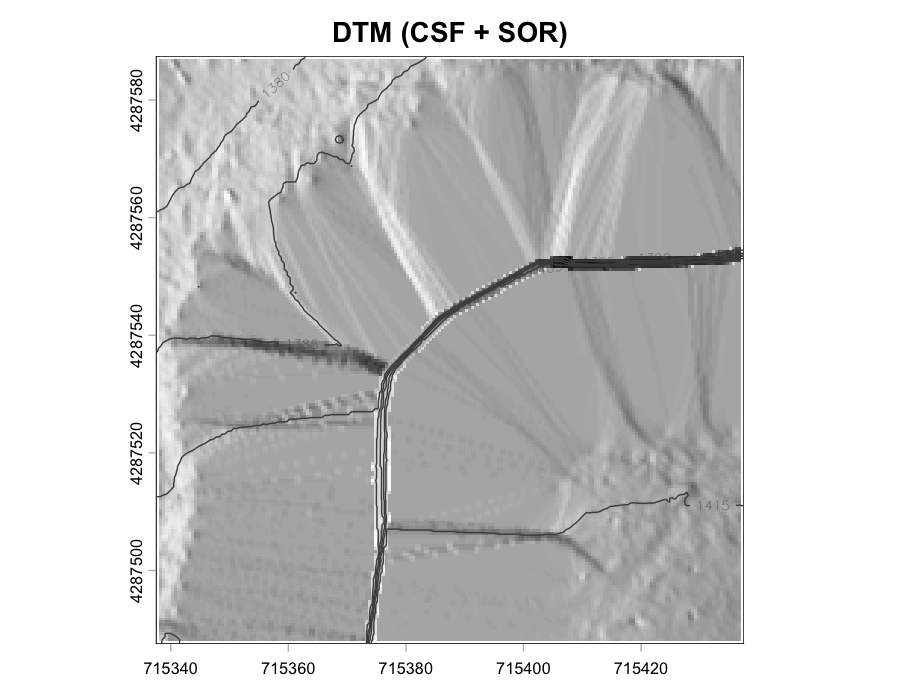{alt="DTM CSF" style="float: left; margin-right: 2%;" width="49%"} 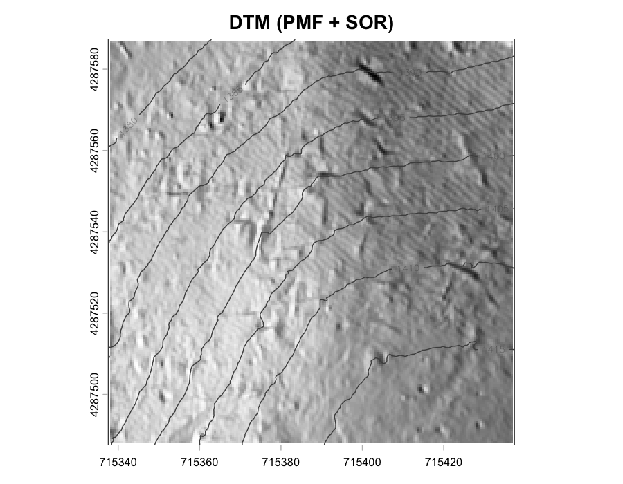{alt="DTM PMF" style="float: left;" width="47.7%"}
:::

**Result**: CSF produces a visibly smoother DTM across the Carr relief gradient.

Compare the Carr tile DTM with the classic lidR Topography sample for reference — the mesh render below comes from `lidR::extdata/Topography.laz`, a frequently reused teaching tile.

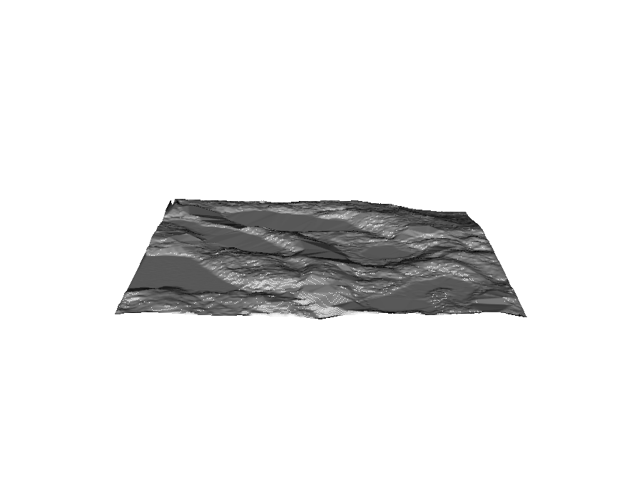{fig-align="center" width="75%"}

------------------------------------------------------------------------

## 1.5 Height Normalization

Transform Z values from absolute elevation to height above ground. Essential input for all canopy analyses.

```{r normalize-height}
#| eval: false

las_norm <- normalize_height(las_csf_sor, knnidw())

# Validate normalization
hist(filter_ground(las_norm)$Z,
     breaks = seq(-0.6, 0.6, 0.01),
     main = "Ground Point Heights",
     xlab = "Elevation (m)")

lidR::writeLAS(las_norm, "../data/las_1ha.laz")
```

::: {style="overflow: auto;"}
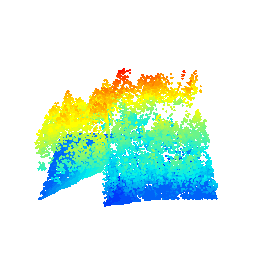{style="float: left; margin-right: 2%;" width="49%"} 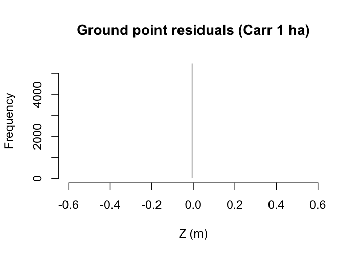{alt="Ground height distribution" style="float: left;" width="43.5%"}
:::

**Validation**: the ground-point histogram should centre near zero. Deviations indicate DTM issues or algorithm failure in complex terrain.

The `lidR::extdata/MixedConifer.laz` sample provides a dramatic illustration of what a normalised canopy surface looks like once pit-free triangulation is applied — the kernel-density "net" below shows individual crowns rising above the ground plane.

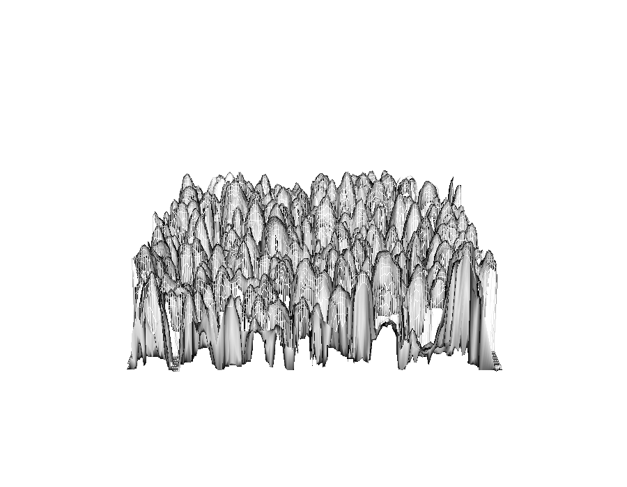{fig-align="center" width="70%"}

------------------------------------------------------------------------

### Runtime Notes

-   311 tiles processed in \~24 hours (high-performance system) on the author's original BC demonstration; the Carr 1 ha AOI completes in under three minutes on a laptop.
-   Bottlenecks: ground classification (60%), DTM interpolation (30%), I/O overhead (10%).
-   Process chunks sequentially if RAM \< 32 GB
-   Increase chunk buffer if edge artifacts visible
-   Use `opt_independent_files()` for parallel tasks

**Common bugs**:

-   Double-counting or insufficient buffering producing edge artifacts in DTM
-   Poor indexing leads to 10x slowdown in catalog operations

------------------------------------------------------------------------

### Runtime Log

```{r}
devtools::session_info()
```
