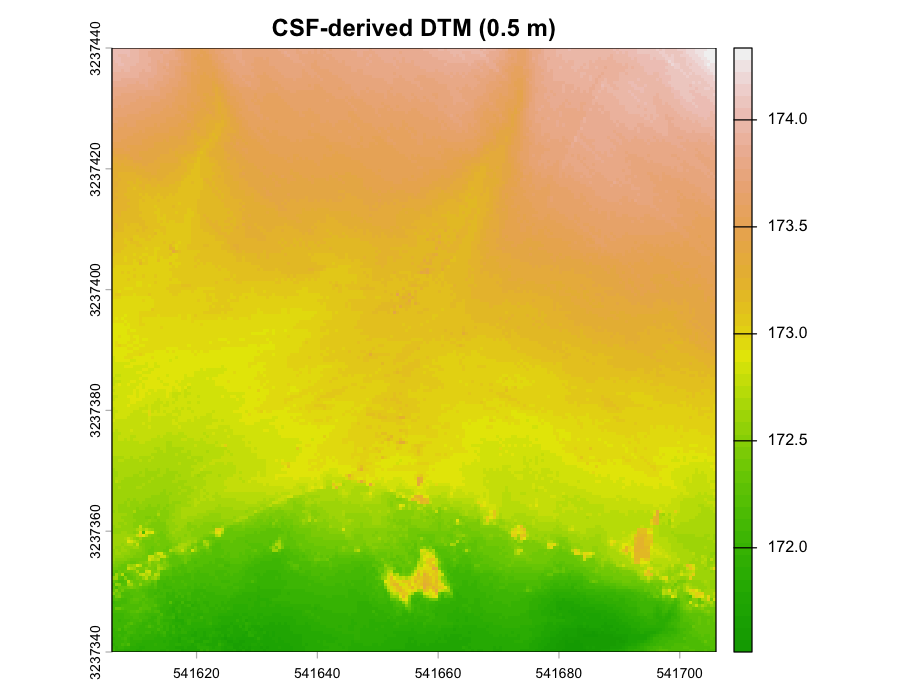
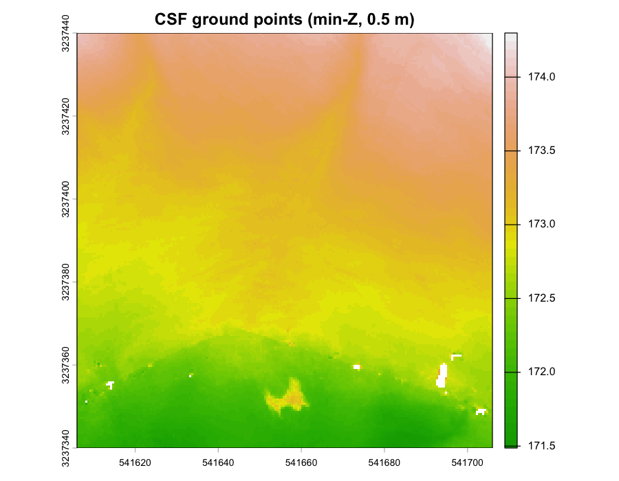
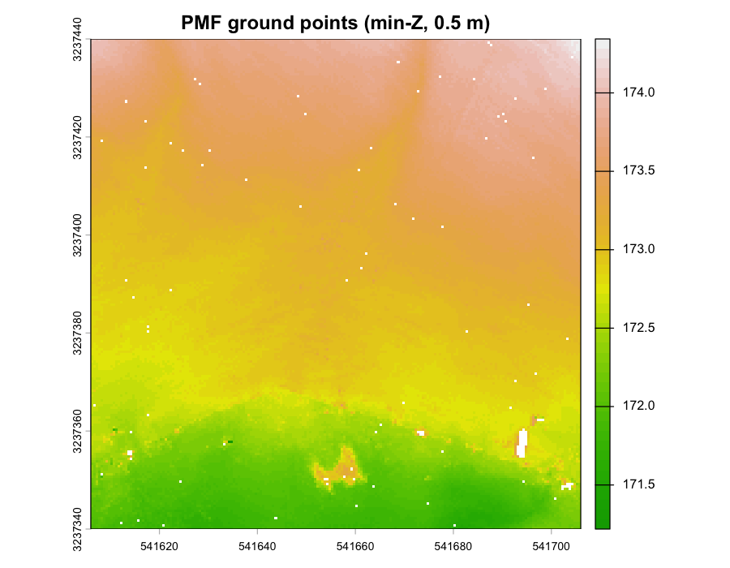
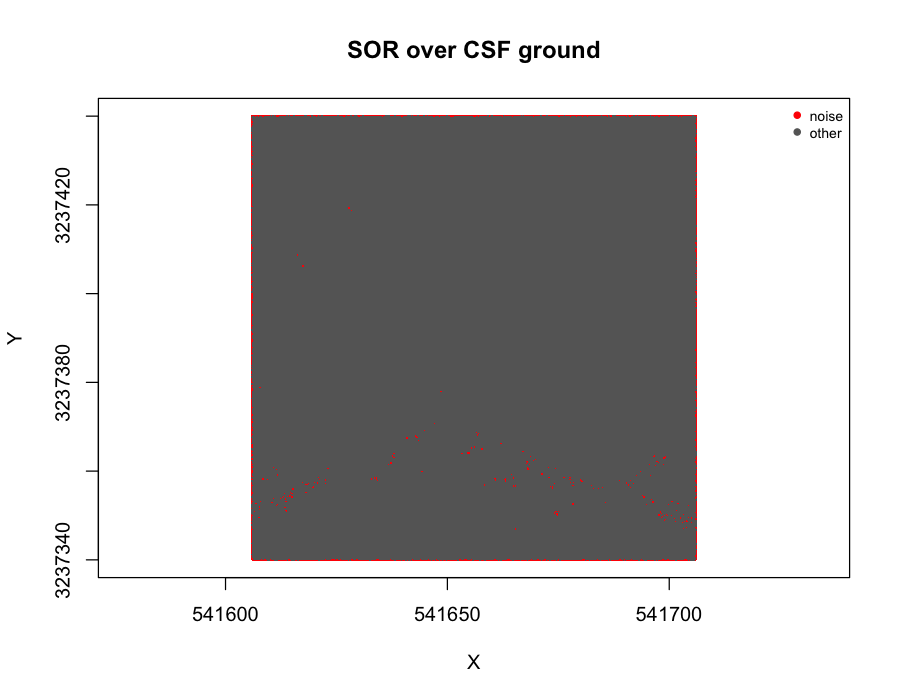
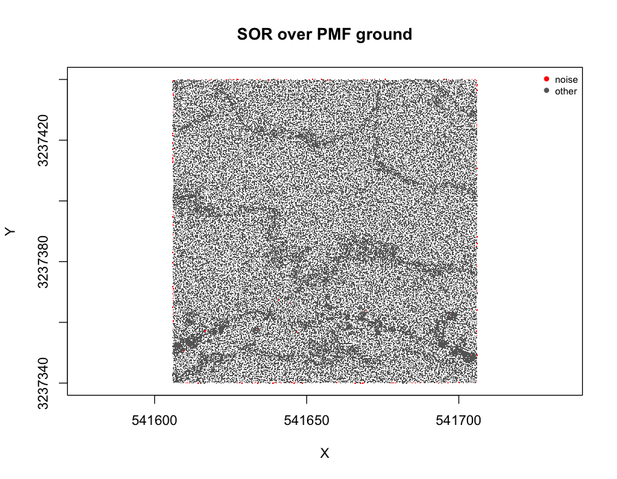
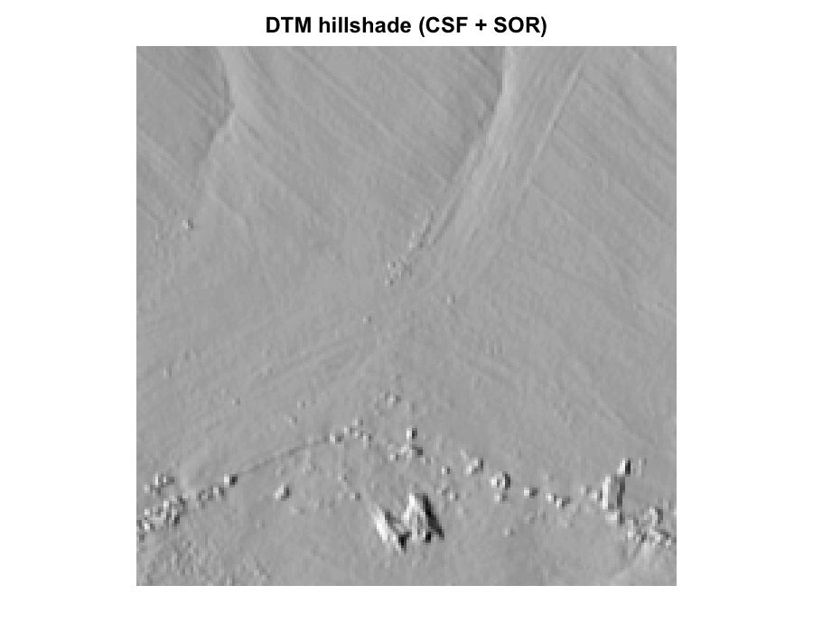
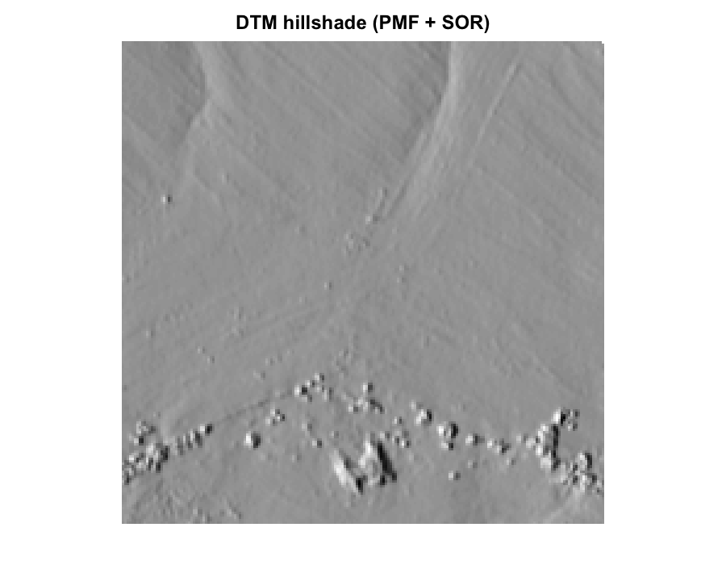
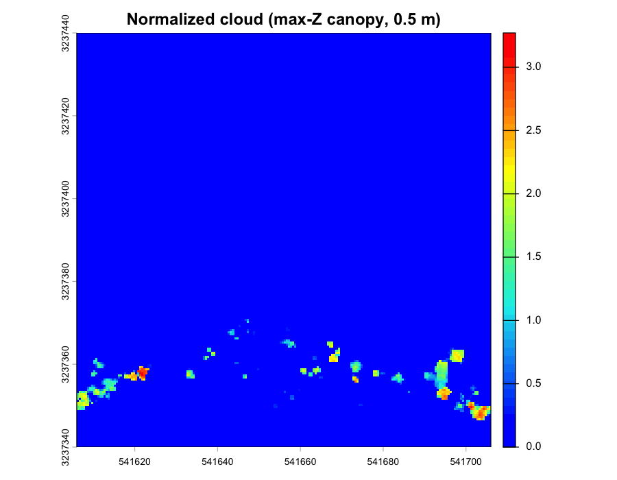
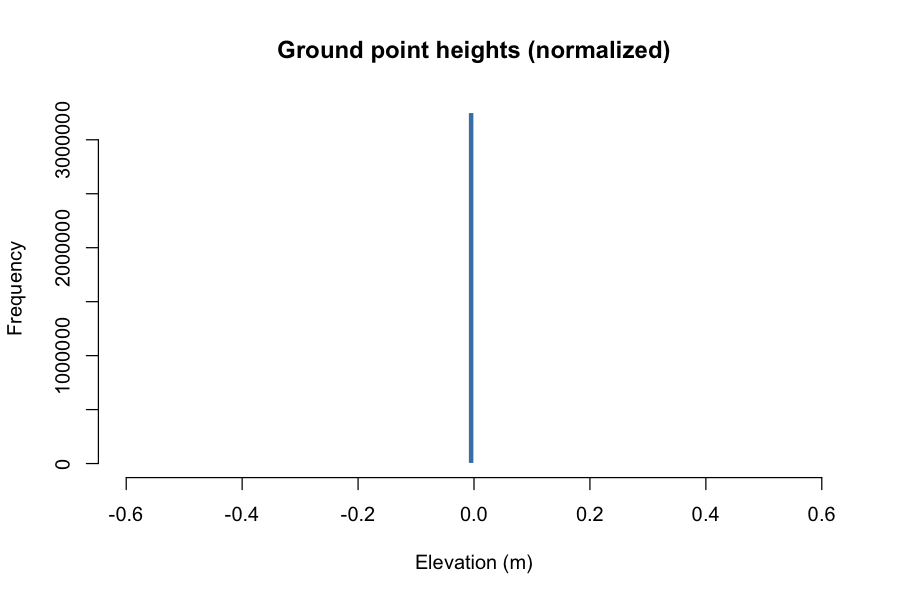

## 1.0 Overview

Raw LiDAR data arrives as massive unclassified point clouds (.xyz, .laz format) containing ground, vegetation, buildings, and noise. This chapter documents the preprocessing pipeline: catalog management, ground classification, noise removal, DTM generation, and height normalization. Output is analysis-ready normalized point clouds for tree detection.

The working example in this and subsequent chapters uses a public-domain UAS survey of an erosion-prone area north of Medina River Natural Area, San Antonio, TX, acquired 2022-07-08 by the USGS Oklahoma-Texas Water Science Center and released under a US Government public-domain mark ([DOI:10.5066/P9KN8RG0](https://doi.org/10.5066/P9KN8RG0)). The source tile is ~80 ha at ~206 pts/m² in NAD83(2011) / UTM 14N with NAVD88 heights; figures are built from a central 1 ha clip.

**Note**: Ground classification and DTM generation on large catalogs can require full-day processing times. Tiling configuration and indexing quality directly impact performance.

### Environment Setup

```{r setup}
#| warning: false
#| message: false
#| error: false
#| echo: true
pacman::p_load(
  "curl",
  "dplyr",
  "fontawesome",
  "htmltools",
  "kableExtra", "knitr",
  "lidR",
  "raster", "reproj",
  "sf",
  "terra", "tmap",
  "useful")
```

```{r}
#| warning: false
#| message: false
#| error: false
#| echo: false

knitr::opts_chunk$set(
  echo = TRUE,
  message = FALSE,
  warning = FALSE,
  error = TRUE,
  comment = NA)

sf::sf_use_s2(use_s2 = FALSE)
options(htmltools.dir.version = FALSE)
tmap_options(max.raster = c(plot = 9500000, view = 10000000))
```

```{css, echo=FALSE, class.source = 'foldable'}
div.column {
    display: inline-block;
    vertical-align: top;
    width: 50%;
}

#TOC::before {
  content: "";
  display: block;
  height:200px;
  width: 200px;
  background-image: url('https://raw.githubusercontent.com/seamusrobertmurphy/lidar-forestry/refs/heads/feature/04-22/assets/PNG/las_tile_medina_norm.png');
  background-size: contain;
  background-position: 50% 50%;
  padding-top: 80px !important;
  background-repeat: no-repeat;
}
```

------------------------------------------------------------------------

## 1.1 Catalog Management

`LAScatalog` handles datasets too large for memory by partitioning data into chunks and processing sequentially or in parallel. For the Medina tile we read the single LAZ and clip a 1 ha AOI near its centre.

```{r import-catalog}
#| warning: false
#| message: false
#| error: false
#| echo: true
#| eval: false

# Read catalog from a single LAZ file.
las_ctg_medina <- readLAScatalog(
  "../assets/data/MNA_pointcloud_20220708.laz",
  select = "xyzrn"
)
opt_chunk_size(las_ctg_medina)   <- 500
opt_chunk_buffer(las_ctg_medina) <- 10
is.indexed(las_ctg_medina)
las_check(las_ctg_medina)
plot(las_ctg_medina, chunk = TRUE)

# Centre-AOI clip used throughout the remaining chapters (1 ha).
bb   <- sf::st_bbox(las_ctg_medina)
cx   <- mean(c(bb["xmin"], bb["xmax"]))
cy   <- mean(c(bb["ymin"], bb["ymax"]))
las_raw <- clip_rectangle(
  las_ctg_medina,
  cx - 50, cy - 50, cx + 50, cy + 50
)
```

**Key parameters**:

-   Buffer = 10m minimizes edge effects
-   Chunk size = 500m works for the compact Medina tile (758 × 1053 m)
-   For multi-tile catalogs, use `opt_filter('-drop_class 19')` to remove overlapping points and `filter_duplicates()`

::: {style="overflow: auto;"}
{alt="Raw Z histogram" style="float: left; margin-right: 2%;" width="43.5%"} {alt="DTM processing" style="float: left;" width="50.2%"}
:::

{fig-align="center" width="95%"}

------------------------------------------------------------------------

## 1.2 Ground Classification

In this section, we compare performances of the Cloth Simulation Filter (`csf()`) with the Progressive Morphological Filter (`pmf()`). The `csf()` algorithm tends to produce a smoother DTM, particularly across variable topography [@zhang2016]. For the Medina tile — which has ~56 m of relief over 100 m of AOI — the CSF output is visibly cleaner and is carried downstream.

```{r}
#| warning: false
#| message: false
#| error: false
#| echo: true
#| eval: false

library(RCSF)

# Apply CSF
las_csf <- classify_ground(las_raw, csf(sloop_smooth = TRUE, 0.5, 1))

# Apply PMF for comparison
las_pmf <- classify_ground(
  las_raw,
  pmf(ws = c(3, 6, 9), th = c(0.5, 1, 1.5))
)
```

::: {style="overflow: auto;"}
{alt="CSF ground" style="float: left; margin-right: 2%;" width="49%"} {alt="PMF ground" style="float: left;" width="49%"}
:::

------------------------------------------------------------------------

## 1.3 Noise Removal

Once ground points are classified, any remaining noise is identified and removed to ensure data integrity. This process was carried out using the Statistical Outlier Removal (`sor`) algorithm with a default neighborhood sample of `k=10` and a multiplier of `m=3`.

The workflow considered four potential methods for noise screening:

1.  Using internal algorithms with the `filter_poi` function and a `LASNOISE` string.
2.  Filtering with `opt_filter` and the `-drop class 19` string.
3.  Screening by a Z-axis threshold (e.g., `Z > 40 & Z < 0`).
4.  Screening by the 95th percentile.

Using `filter_poi` with an internal algorithm was found to be slower in the long run due to loss of spatial indexing after a new catalog object was assigned.

```{r}
#| warning: false
#| message: false
#| error: false
#| echo: true
#| eval: false

las_csf_so  <- classify_noise(las_csf, sor(k = 10, m = 3))
las_csf_sor <- filter_poi(las_csf_so, Classification != LASNOISE)

las_pmf_so  <- classify_noise(las_pmf, sor(k = 10, m = 3))
las_pmf_sor <- filter_poi(las_pmf_so, Classification != LASNOISE)
```

::: {style="overflow: auto;"}
{alt="Noise removal CSF" style="float: left; margin-right: 2%;" width="49%"} {alt="Noise removal PMF" style="float: left;" width="49%"}
:::

------------------------------------------------------------------------

## 1.4 Digital Terrain Model

Rasterization is empirically paramount to terrain analysis as it shapes all subsequent height-based estimates. The Inverse Distance Weighting (`knnidw`) algorithm was employed due to its efficiency, robustness, and known sensitivity to lake anomalies [@tu2020]. Parameters:

-   Default maximum radius of 50 m
-   Neighborhood of `10`
-   Inverse distance weighting power of `2`
-   Resolution of `0.5 m` (matches the dense UAS point spacing)

```{r}
#| warning: false
#| message: false
#| error: false
#| echo: true
#| eval: false

dtm_csf <- rasterize_terrain(las_csf_sor, res = 0.5,
                             knnidw(k = 10, p = 2, rmax = 50))
dtm_pmf <- rasterize_terrain(las_pmf_sor, res = 0.5,
                             knnidw(k = 10, p = 2, rmax = 50))

# Hillshade visualization
slope   <- terra::terrain(dtm_csf, "slope",  unit = "radians")
aspect  <- terra::terrain(dtm_csf, "aspect", unit = "radians")
hs      <- terra::shade(slope, aspect, angle = 40, direction = 270)
terra::plot(hs, col = grey(0:100/100), legend = FALSE)
```

::: {style="overflow: auto;"}
{alt="DTM CSF" style="float: left; margin-right: 2%;" width="49%"} {alt="DTM PMF" style="float: left;" width="47.7%"}
:::

**Result**: CSF produces a visibly smoother DTM across the Medina relief gradient.

------------------------------------------------------------------------

## 1.5 Height Normalization

Transform Z values from absolute elevation to height above ground. Essential input for all canopy analyses.

```{r normalize-height}
#| eval: false

las_norm <- normalize_height(las_csf_sor, knnidw())

# Validate normalization
hist(filter_ground(las_norm)$Z,
     breaks = seq(-0.6, 0.6, 0.01),
     main = "Ground Point Heights",
     xlab = "Elevation (m)")

lidR::writeLAS(las_norm, "../data/las_1ha.laz")
```

::: {style="overflow: auto;"}
{style="float: left; margin-right: 2%;" width="49%"} {alt="Ground height distribution" style="float: left;" width="43.5%"}
:::

**Validation**: Ground point histogram should center near zero. Deviations indicate DTM issues or algorithm failure in complex terrain.

------------------------------------------------------------------------

### Runtime Notes

-   311 tiles processed in \~24 hours (high-performance system) for the original BC demonstration; the Medina 1 ha AOI completes in under two minutes on a laptop.
-   Bottlenecks: ground classification (60%), DTM interpolation (30%), I/O overhead (10%).
-   Process chunks sequentially if RAM \< 32GB
-   Increase chunk buffer if edge artifacts visible
-   Use `opt_independent_files()` for parallel tasks

**Common bugs**:

-   Double-counting or insufficient buffering producing edge artifacts in DTM
-   Poor indexing leads to 10x slowdown in catalog operations

------------------------------------------------------------------------

### Runtime Log

```{r}
devtools::session_info()
```
