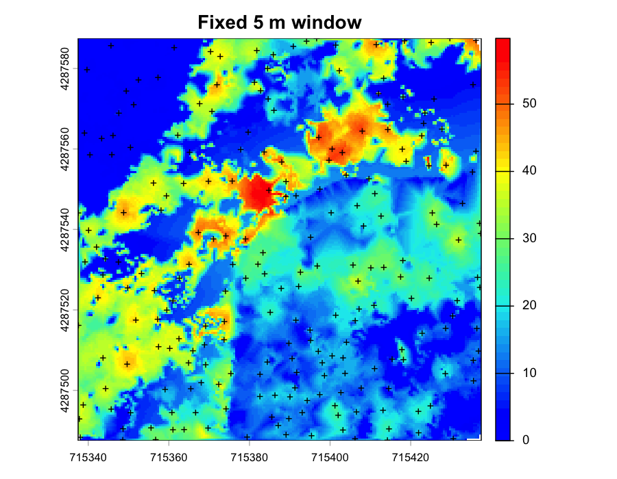
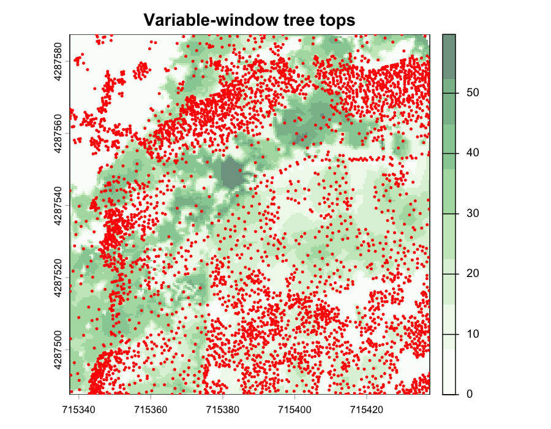
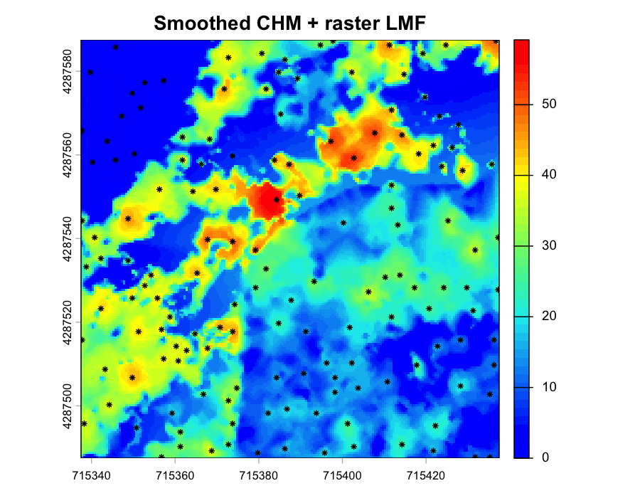
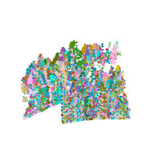
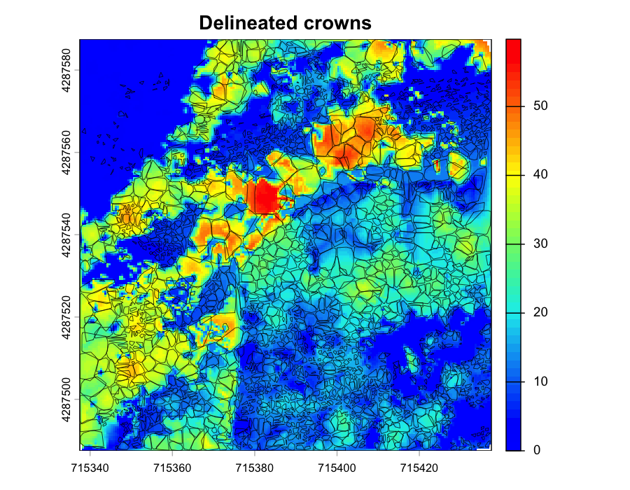
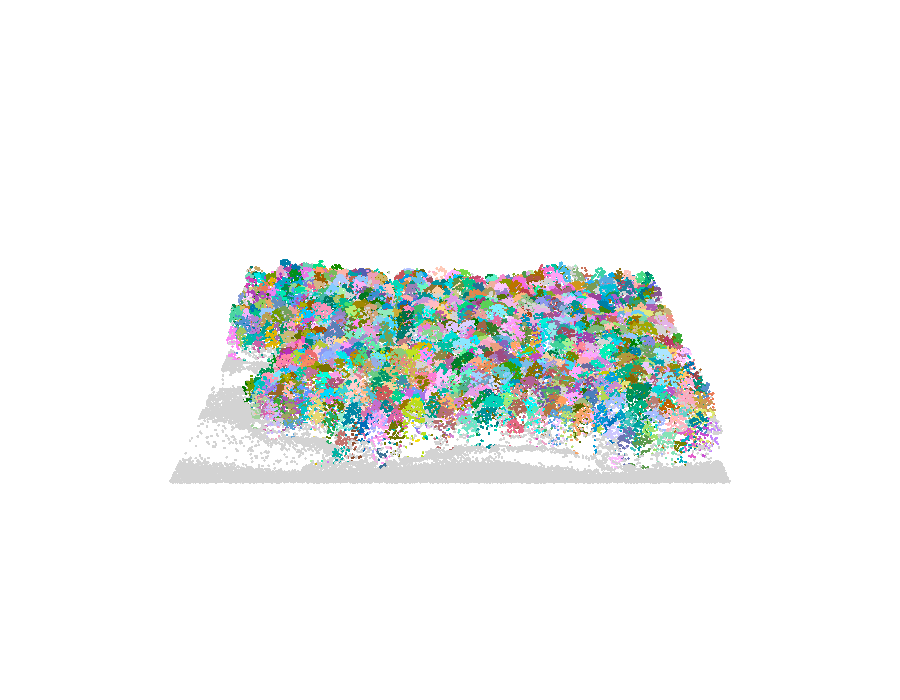
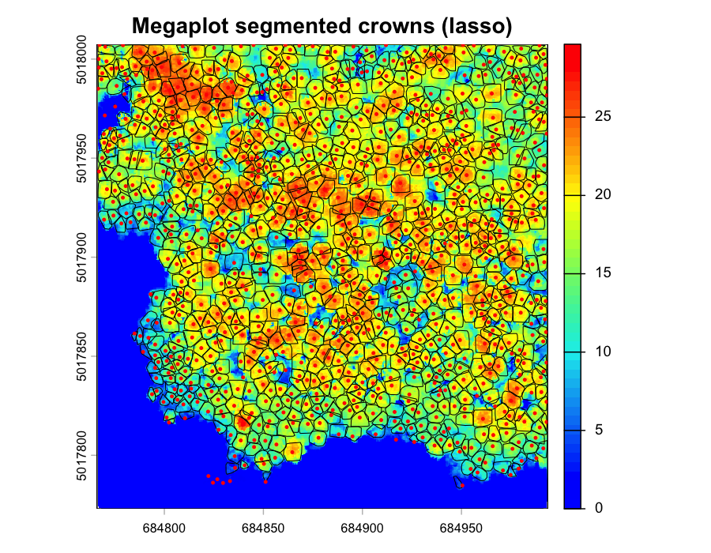

## 2.0 Overview

Individual tree detection (ITD) spatially locates trees and extracts height information from LiDAR point clouds or canopy height models (CHM). Individual tree segmentation (ITS) delineates crown boundaries for detected trees. This chapter demonstrates both approaches using the local maximum filter (`lmf`) method and compares point cloud-based versus raster-based workflows on the 1 ha Carr Fire clip normalised in Chapter 1.

It is important to include the `uniqueness` parameter in `locate_trees()` operations when processing tiled data. This is essential to prevent duplicate tree detection at tile boundaries. Trees detected in overlapping buffer zones can be counted multiple times without this parameter. Always use `uniqueness="bitmerge"` for tiled workflows.

**Note**: Tree detection across large catalogs is the most time-intensive stage. Dense canopies and high point densities substantially increase processing time. Expect multi-hour runtimes for operational-scale projects.

------------------------------------------------------------------------

### Environment Setup

```{r setup}
#| warning: true
#| message: true
#| error: true
#| echo: true
pacman::p_load(
  "curl",
  "dplyr",
  "fontawesome", "ForestTools",
  "htmltools", "httr2",
  "janitor",
  "kableExtra", "knitr",
  "lidR", "lutz",
  "openxlsx",
  "PROJ",
  "raster", "rasterVis", "reproj", "RCSF", "RColorBrewer",
  "sf",
  "tinytex", "tmap", "tmaptools", "terra",
  "useful", "usethis"
  )
```

```{r}
#| warning: false
#| message: false
#| error: false
#| echo: false
knitr::opts_chunk$set(tidy.opts = list(width.cutoff=60),
  echo    = TRUE,
  message = FALSE,
  warning = FALSE,
  error   = TRUE,
  comment = NA
  )

sf::sf_use_s2(use_s2 = FALSE)
options(
  htmltools.dir.version = FALSE,
  htmltools.preserve.raw = FALSE,
  tinytex.verbose = TRUE
  )

tmap_options(max.raster = c(plot = 9500000, view = 10000000))
```

```{css, echo=FALSE, class.source = 'foldable'}
div.column {
    display: inline-block;
    vertical-align: top;
    width: 50%;
}

#TOC::before {
  content: "";
  display: block;
  height:200px;
  width: 200px;
  background-image: url('../assets/PNG/stem_detect_D.png');
  background-size: contain;
  background-position: 50% 50%;
  padding-top: 80px !important;
  background-repeat: no-repeat;
}
```

## 2.1 Point Cloud Method

The local maxima filter (`lmf()`) algorithm identifies tree tops directly from normalized point clouds[^index-1] without rasterization. For each point, the algorithm analyzes neighborhood points within a specified radius to determine if the point represents a local maximum.

### Fixed Windows

Constant window size detection is computationally efficient but may over-detect in dense canopies or miss suppressed trees in heterogeneous stands.

-   Small windows (`ws=3`): High detection rate, increased false positives
-   Large windows (`ws=11`): Detects only dominant trees, omits understory

```{r}
#| warning: false
#| message: false
#| error: false
#| eval: false
#| echo: true

# Load the normalised Carr 1 ha AOI written in Chapter 1
las_ha <- lidR::readALSLAS("../data/las_1ha.laz")

# Detect tree tops with a fixed 5 m window
ttops <- locate_trees(las_ha, lmf(ws = 5))

# Visualise on a half-metre CHM
chm <- rasterize_canopy(las_ha, res = 0.5, pitfree(subcircle = 0.2))
plot(chm, col = height.colors(50))
plot(st_geometry(ttops), add = TRUE, pch = 3)

# Save outputs
terra::writeRaster(chm, "../data/chm_1m.tif", overwrite = TRUE)
sf::st_write(ttops, "../data/ttops_1ha.gpkg", delete_dsn = TRUE)
```

{fig-align="center" width="95%"}

### Variable Windows

Dynamic window functions adapt search radius to point height, accounting for allometric relationships between tree height and crown diameter. This approach improves detection accuracy in mixed-structure stands.

-   Minimum window ≥ 0.5 m to avoid spurious detections
-   Threshold heights \<2 m handled by the lower bound in `pmax`
-   Functions must return positive values for all input heights

```{r}
#| warning: false
#| message: false
#| error: false
#| eval: false
#| echo: true

# Window function tuned for the Carr Fire stand (mixed conifer regrowth,
# scattered residual overstory)
wf <- function(x) {
  y <- 0.07 * x + 0.6
  pmax(y, 0.5)
}

# Visualize window behaviour
heights <- seq(0, 40, 0.5)
window  <- wf(heights)
plot(heights, window, type = "l",
     xlab = "point elevation (m)",
     ylab = "window diameter (m)")

# Detect tree stems
ttops    <- locate_trees(las_ha, lmf(wf), uniqueness = "bitmerge")
ttops_sf <- sf::st_as_sf(ttops)

mypalette <- RColorBrewer::brewer.pal(8, "Greens")
plot(chm, col = mypalette, alpha = 0.6)
plot(st_geometry(ttops_sf["treeID"]), add = TRUE, cex = 0.5,
     pch = 20, col = "red")
```

::: {style="overflow: auto;"}
{alt="Variable window function" style="float: left; margin-right: 2%;" width="58%"} {alt="Variable-window tree tops" style="float: left;" width="39%"}
:::

## 2.2 Rasterized Method

CHM-based detection is faster than point cloud methods due to reduced data volume, but results depend on CHM resolution, interpolation algorithm, and post-processing steps.

```{r}
#| eval: false
# Median filter raster smoothing
kernel     <- matrix(1, 3, 3)
chm_smooth <- terra::focal(chm, w = kernel, fun = median, na.rm = TRUE)

# Detect trees on smoothed CHM
ttops_chm <- locate_trees(chm_smooth, lmf(5))

plot(chm_smooth, col = height.colors(50))
plot(st_geometry(ttops_chm), add = TRUE, pch = 8)
```

{fig-align="center"}

------------------------------------------------------------------------

## 2.3 Crown Segmentation

Crown delineation assigns tree IDs to individual points or pixels using detected tree tops as seeds. Boundaries are grown with Dalponte's algorithm [@dalponte2016tree]: each tree top seeds a region that expands outward until local minima in the CHM close the crown. The result is convex polygons representing individual crown extents.

Before handing the tree tops to `dalponte2016()`, renumber them as a plain integer sequence. Uniqueness strategies like `"bitmerge"` produce 64-bit IDs that the segmentation algorithm cannot accept in a single-tile context.

```{r}
#| eval: false
ttops$treeID <- seq_len(nrow(ttops))

algo    <- dalponte2016(chm, ttops)
las_seg <- segment_trees(las_ha, algo)

crowns <- crown_metrics(las_seg, func = .stdtreemetrics,
                        geom = "convex")

plot(las_seg, bg = "white", size = 2.5, color = "treeID")
plot(sf::st_geometry(crowns))
```

::: {style="overflow: auto;"}
{alt="Segmented tree IDs" style="float: left; margin-right: 2%;" width="55%"} {alt="Crown delineation" style="float: left;" width="42.5%"}
:::

For a denser, fully-canopied reference, the lidR `Megaplot.laz` sample yields the familiar "lasso" of coloured crowns below — useful for sanity-checking that your segmentation recovers recognisable tree outlines when the input is tree-rich.

::: {style="overflow: auto;"}
{alt="Megaplot 3D" style="float: left; margin-right: 2%;" width="55%"} {alt="Megaplot lasso" style="float: left;" width="42.5%"}
:::

## 2.4 Validation

Detection accuracy varies by forest structure and parameterisation. The following is a quick sanity check against a nominal field count for the Carr 1 ha AOI.

```{r}
#| eval: false
detected_count <- nrow(ttops)
field_count    <- 180   # nominal comparison value

detection_rate <- detected_count / field_count
omission_rate  <- 1 - detection_rate

cat("Detection rate:", round(detection_rate * 100, 1), "%\n")
cat("Omission rate:",  round(omission_rate  * 100, 1), "%\n")
```

------------------------------------------------------------------------

### Runtime Log

```{r}
devtools::session_info()
```

[^index-1]: Data used in this chapter are a public-domain USGS 3DEP release:

    -   <https://rockyweb.usgs.gov/vdelivery/Datasets/Staged/Elevation/LPC/Projects/CA_CarrHirzDeltaFires_2019_B19/CA_CarrHirzDeltaFires_2_2019/> — Quality Level 1 airborne lidar point cloud over the Carr / Hirz / Delta Fires burn scar, Shasta County, CA. Tile 10SGH1587 (UTM 10N, NAD83(2011) / NAVD88 Geoid18) is used for the 1 ha working example.
