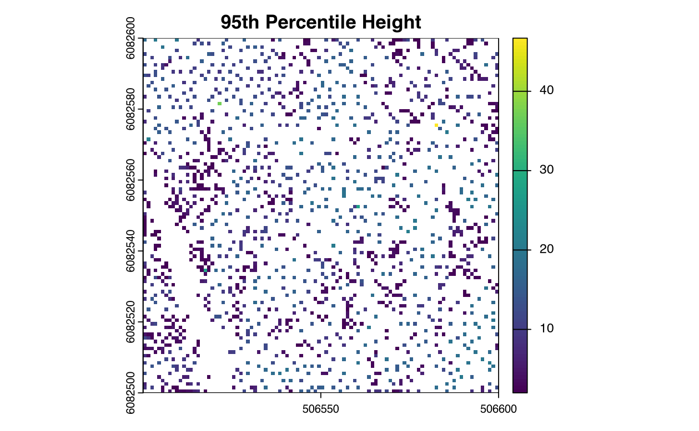

## 3.0 Overview

Canopy Height Models (CHM) represent vertical distance from ground to canopy top across the landscape. CHMs derived from normalized LiDAR point clouds serve as primary inputs for tree detection, biomass estimation, and forest inventory. This chapter documents operational workflows for CHM aggregation, dominant-height extraction, and quality control procedures using the Medina River 1 ha AOI normalized in Chapter 1.

------------------------------------------------------------------------

### Environment Setup

```{r setup}
#| warning: false
#| message: false
#| error: false
#| echo: true
pacman::p_load(
  "curl",
  "dplyr",
  "fontawesome",
  "htmltools", "httr2",
  "janitor",
  "kableExtra", "knitr",
  "lidR", "lutz",
  "openxlsx",
  "PROJ",
  "raster", "rasterVis", "reproj",
  "sf",
  "tinytex", "tmap", "tmaptools", "terra",
  "useful", "usethis"
  )
```

```{r}
#| warning: false
#| message: false
#| error: false
#| echo: false
knitr::opts_chunk$set(
  echo = TRUE,
  message = FALSE,
  warning = FALSE,
  error = TRUE,
  comment = NA,
  tidy.opts = list(
    width.cutoff = 60)
  )

sf::sf_use_s2(use_s2 = FALSE)

options(htmltools.dir.version = FALSE,
        htmltools.preserve.raw = FALSE,
        tinytex.verbose = TRUE
        )

tmap_options(max.raster = c(plot = 9500000, view = 10000000))
```

```{css, echo=FALSE, class.source = 'foldable'}
div.column {
    display: inline-block;
    vertical-align: top;
    width: 50%;
}

#TOC::before {
  content: "";
  display: block;
  height:200px;
  width: 200px;
  background-image: url('https://raw.githubusercontent.com/seamusrobertmurphy/lidar-forestry/refs/heads/feature/04-22/assets/PNG/stem_detect_G.png');
  background-size: contain;
  background-position: 50% 50%;
  padding-top: 80px !important;
  background-repeat: no-repeat;
}
```

------------------------------------------------------------------------

## 3.1 Prepare CHM

Create 1 m resolution CHM from the normalized point cloud using triangulation.

```{r}
#| warning: false
#| message: false
#| error: false
#| echo: true
#| eval: true
# Import outputs from previous chapter
las   <- lidR::readALSLAS("../data/las_1ha.laz")
ttops <- sf::read_sf("../data/ttops_1ha.gpkg", quiet = TRUE)

# Generate 1 m CHM
chm <- lidR::rasterize_canopy(las, res = 1, dsmtin(max_edge = 8))
terra::plot(chm, col = height.colors(50))
```

------------------------------------------------------------------------

## 3.2 Extract Dominant Height

### Points Extraction

Extract dominant height directly from point clouds without rasterizing. This method is slower but preserves full point information. The `ttops` object is derived in [Chapter 2: Stem Detection](https://seamusrobertmurphy.quarto.pub/lidar-forestry/02-stem-detect/).

```{r}
#| eval: true
# Create a 1 m grid
grid       <- sf::st_make_grid(ttops, cellsize = 1, square = TRUE)
grid_sf    <- sf::st_sf(grid_id = 1:length(grid), geometry = grid)
ttops_grid <- sf::st_join(ttops, grid_sf)

ttops_95h <- ttops_grid |>
    sf::st_drop_geometry() |>
    dplyr::group_by(grid_id) |>
    dplyr::summarise(
      count = dplyr::n(),
      `95thQuantile` = quantile(Z, 0.95, na.rm = TRUE),
      Max = max(Z, na.rm = TRUE),
      .groups = "drop"
    ) |>
    dplyr::right_join(grid_sf, by = "grid_id") |>
    sf::st_as_sf()

# Convert to raster
ttops_95h_rast <- terra::rasterize(
  terra::vect(ttops_95h),
  terra::rast(terra::ext(ttops_95h), res = 1, crs = terra::crs(ttops_95h)),
  field = "95thQuantile"
)

terra::plot(ttops_95h_rast, main = "95th Percentile Height")
```



------------------------------------------------------------------------

### Raster Extraction

Aggregate CHM using 95th percentile statistics. This method is faster for large catalogs.

```{r}
#| eval: true

# Define 95th percentile function
quant95 <- function(x, ...) {
    quantile(x, probs = 0.95, na.rm = TRUE)
}

# Aggregate using q95 (2x means a 2 m output cell from 1 m input)
chm_95h <- terra::aggregate(
    chm,
    fact = 2,
    fun = quant95
)

terra::plot(chm_95h, main = "95th Percentile Height")
terra::writeRaster(chm_95h, "../data/chm_95h.tif", overwrite = TRUE)
```

------------------------------------------------------------------------

## 3.3 Validation

Compare 95th percentile CHM against detected tree heights from Chapter 2.

```{r}
#| eval: true
# Extract CHM values at tree locations
ttops$chm_95h <- terra::extract(terra::rast(chm_95h), terra::vect(ttops))[, 2]

# Statistics
validation <- ttops |>
    dplyr::summarise(
        correlation = cor(Z, chm_95h, use = "complete.obs"),
        rmse = sqrt(mean((Z - chm_95h)^2, na.rm = TRUE)),
        mae = mean(abs(Z - chm_95h), na.rm = TRUE),
        bias = mean(Z - chm_95h, na.rm = TRUE)
    )

print(validation)
```

------------------------------------------------------------------------

## 3.4 Build Mosaic

Merge all operating areas into single product for Chapter 4. For the Medina demonstration the AOI is a single tile, so the 95th-percentile raster from §3.2 is the input to the biomass model in Chapter 4.

```{r}
#| eval: false
# With multi-area datasets the mosaic step loops over per-area CHM rasters.
# area_chms <- lapply(areas, function(a) raster(sprintf("../data/chm-tiles/%s.tif", a)))
# chm_95h_final <- do.call(merge, c(area_chms, tolerance = 1))
# writeRaster(chm_95h_final, "../data/chm_95h.tif", overwrite = TRUE)
```

This raster is the dominant height input for biomass models in Chapter 4.

------------------------------------------------------------------------

### Runtime Log

```{r}
devtools::session_info()
```
