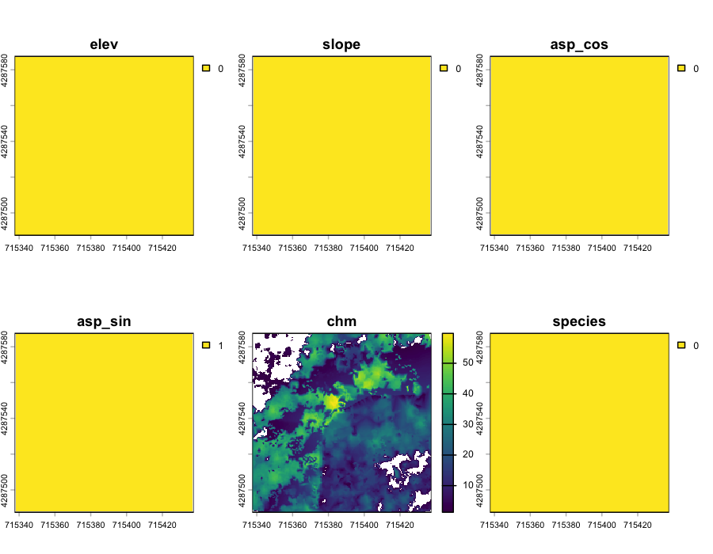
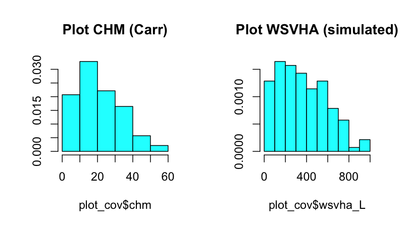
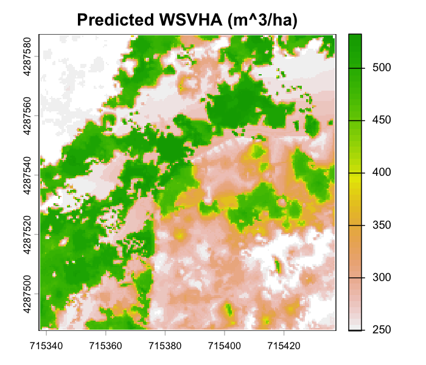
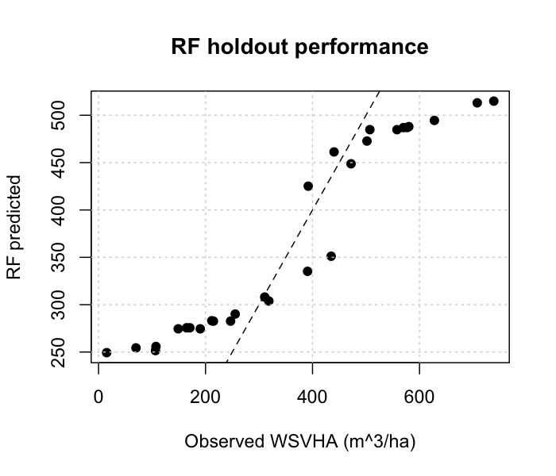

------------------------------------------------------------------------

## 4.0 Overview

LiDAR-derived metrics enable wall-to-wall biomass and volume predictions when calibrated with field inventory data. This chapter demonstrates the complete workflow on the Carr Fire 1 ha AOI from Chapter 1: covariate preparation, a simulated plot dataset, random-forest training with a holdout, and spatial prediction of whole-stem volume per hectare (WSVHA, m³/ha).

The plot data below are **simulated** over the Carr AOI — the USGS 3DEP release is copyright-clear, but no public field inventory plots accompany it. The response surface is drawn from LiDAR-derived CHM, terrain, and a synthetic species raster with additive Gaussian noise. This preserves the structure of the real workflow (plot → model → raster) without depending on proprietary BC FAIB/VRI layers.

### Environment Setup

```{r setup}
#| warning: false
#| message: false
#| error: false
#| echo: true
pacman::p_load(
  "caret", "curl",
  "dplyr",
  "fontawesome",
  "htmltools", "httr2",
  "janitor",
  "kableExtra", "knitr",
  "leaflet", "lidR", "lutz",
  "MASS",
  "openxlsx",
  "PROJ",
  "randomForest", "raster", "rasterVis", "reproj",
  "sf",
  "tinytex", "tmap", "tmaptools", "terra",
  "useful", "usethis",
  "webshot", "webshot2", "weathercan")
```

```{r}
#| warning: false
#| message: false
#| error: false
#| echo: false

knitr::opts_chunk$set(
  echo = TRUE,
  message = FALSE,
  warning = FALSE,
  error = TRUE,
  comment = NA,
  tidy.opts = list(
    width.cutoff = 60)
  )

sf::sf_use_s2(use_s2 = FALSE)

options(htmltools.dir.version = FALSE,
        htmltools.preserve.raw = FALSE,
        tinytex.verbose = TRUE
        )

tmap_options(max.raster = c(plot = 9500000, view = 10000000))
```

```{css, echo=FALSE, class.source = 'foldable'}
div.column {
    display: inline-block;
    vertical-align: top;
    width: 50%;
}

#TOC::before {
  content: "";
  display: block;
  height:200px;
  width: 200px;
  background-image: url('../assets/PNG/stem_detect_C.png');
  background-size: contain;
  background-position: 50% 50%;
  padding-top: 1px !important;
  background-repeat: no-repeat;
}
```

------------------------------------------------------------------------

## 4.1 Spatial Covariates

### Import LiDAR

```{r}
#| eval: false
las <- lidR::readALSLAS("../data/las_1ha.laz")
dtm <- lidR::rasterize_terrain(las, res = 0.5, algorithm = tin())
lidR::plot_dtm3d(dtm, bg = "white")

terra::writeRaster(dtm, "../data/dtm_1m.tif", overwrite = TRUE)
```

### Terrain Covariates

Derive slope and aspect from the DTM. Transform aspect to northness (cosine) and eastness (sine) to avoid circular-variable issues.

```{r}
#| eval: false
elev <- terra::rast("../data/dtm_1m.tif")

slope     <- terra::terrain(elev, v = "slope", unit = "degrees", neighbors = 8)
slope_pct <- terra::clamp(base::tan(slope * pi/180) * 100, 0, 100)

aspect  <- terra::terrain(elev, v = "aspect", unit = "degrees", neighbors = 8)
asp_cos <- cos((aspect * pi) / 180)   # Northness
asp_sin <- sin((aspect * pi) / 180)   # Eastness

terra::writeRaster(elev,      "../data/elev_1m.tif",      overwrite = TRUE)
terra::writeRaster(slope_pct, "../data/slope_1m.tif",     overwrite = TRUE)
terra::writeRaster(asp_cos,   "../data/northness_1m.tif", overwrite = TRUE)
terra::writeRaster(asp_sin,   "../data/eastness_1m.tif",  overwrite = TRUE)
```

{fig-align="center" width="95%"}

### Canopy Covariate

Create a 0.5 m CHM from the normalized tile and apply a 1.3 m vegetation threshold so open ground does not pollute the canopy layer.

```{r}
#| eval: false
las_ha <- lidR::readALSLAS("../data/las_1ha.laz")
chm    <- lidR::rasterize_canopy(las_ha, res = 0.5, lidR::pitfree(subcircle = 0.2))

chm[chm < 1.3] <- NA
terra::writeRaster(chm, "../data/chm_1m.tif", overwrite = TRUE)
```

------------------------------------------------------------------------

## 4.2 Species Covariate

### Synthetic Species Raster

For the Carr Fire demonstration there is no local vegetation-inventory layer, so we derive a two-class species raster from terrain: higher-slope pixels are recoded to "mixed conifer" and lower-slope pixels to "open / shrub", then smoothed with a 7 × 7 modal filter to suppress salt-and-pepper artifacts. In the original BC workflow this slot was filled by the Vegetation Resource Inventory (VRI) `SPECIES_CD_1` attribute.

```{r}
#| eval: false
slope_pct <- terra::rast("../data/slope_1m.tif")

spp_base <- terra::app(slope_pct, function(v) ifelse(v > 8, 2, 0))
spp_base <- terra::focal(spp_base, w = matrix(1, 7, 7), fun = "modal",
                         na.rm = TRUE)
names(spp_base) <- "species"

terra::writeRaster(spp_base, "../data/species.tif", overwrite = TRUE)
```

**Species coding rationale:**

-   Numeric classes enable regression models
-   Two classes are the minimum useful categorical split at 1 ha AOI scale
-   Modal filtering preserves class boundaries while smoothing noise

------------------------------------------------------------------------

## 4.3 Stack Covariates

```{r}
#| eval: false
elev    <- terra::rast("../data/elev_1m.tif")
slope   <- terra::rast("../data/slope_1m.tif")
asp_cos <- terra::rast("../data/northness_1m.tif")
asp_sin <- terra::rast("../data/eastness_1m.tif")
chm     <- terra::rast("../data/chm_1m.tif")
species <- terra::rast("../data/species.tif")

names(elev)    <- "elev"
names(slope)   <- "slope"
names(asp_cos) <- "asp_cos"
names(asp_sin) <- "asp_sin"
names(chm)     <- "chm"
names(species) <- "species"

chm_r     <- terra::resample(chm,     elev, method = "bilinear")
species_r <- terra::resample(species, elev, method = "near")

covs <- c(elev, slope, asp_cos, asp_sin, chm_r, species_r)
names(covs) <- c("elev", "slope", "asp_cos", "asp_sin", "chm", "species")
terra::plot(covs)
```

------------------------------------------------------------------------

## 4.4 Simulated Plot Data

### Generate Synthetic Plots

Draw 150 plot centroids uniformly across the Carr AOI and sample the covariate stack at each point. The WSVHA response is built from a CHM-dominated linear expression with additive Gaussian noise, so the downstream modelling is demonstrable without proprietary field data.

```{r}
#| eval: false
set.seed(20230718)
bb <- terra::ext(covs)
pts <- data.frame(
  x = runif(150, bb[1] + 5, bb[2] - 5),
  y = runif(150, bb[3] + 5, bb[4] - 5)
)
plot_cov <- cbind(pts, terra::extract(covs, as.matrix(pts)))

plot_cov$wsvha_L <- with(plot_cov,
  pmax(0,
       18 * chm + 0.8 * slope + 30 * (species == 2) - 5 +
         rnorm(nrow(plot_cov), 0, 25))
)
plot_cov <- na.omit(plot_cov)
```

### Distribution Matching (optional)

In the original BC workflow the FAIB plot distribution was bootstrap-reweighted to match the raster-derived `lead_htop` distribution. With a simulated plot set that is already drawn uniformly over the raster, this step is optional and shown for reference:

```{r}
#| eval: false
dens_fun <- approxfun(density(plot_cov$chm, adjust = 0.8))
boot_w   <- dens_fun(plot_cov$chm)

plot_cov_boot <- dplyr::slice_sample(plot_cov, n = 1000,
                                     weight_by = boot_w, replace = TRUE)

par(mfrow = c(1, 2))
MASS::truehist(plot_cov$chm,      main = "Simulated plot CHM")
MASS::truehist(plot_cov_boot$chm, main = "Reweighted plot CHM")
```

{fig-align="center" width="85%"}

**Bootstrapping rationale:** Reduces systematic bias when field plots under-represent certain height classes present in raster data.

------------------------------------------------------------------------

## 4.5 Train-Test Split

```{r}
#| eval: false
idx <- caret::createDataPartition(plot_cov$wsvha_L, p = 0.80, list = FALSE)

train <- plot_cov[idx,  ]
test  <- plot_cov[-idx, ]

X_train <- train[, c("elev", "slope", "asp_cos", "asp_sin", "chm", "species")]
y_train <- train$wsvha_L
X_test  <- test[,  c("elev", "slope", "asp_cos", "asp_sin", "chm", "species")]
y_test  <- test$wsvha_L
```

------------------------------------------------------------------------

## 4.6 Model Training

### Random Forest Regression

```{r}
#| eval: false
library(randomForest)
library(caret)

rf <- randomForest::randomForest(
  wsvha_L ~ elev + slope + asp_cos + asp_sin + chm + species,
  data = train, ntree = 300, mtry = 3
)

rf_predictions <- predict(rf, X_test)

rf_mae  <- caret::MAE (rf_predictions, y_test)
rf_rmse <- caret::RMSE(rf_predictions, y_test)
rf_r2   <- caret::R2  (rf_predictions, y_test)

cat("MAE:",  round(rf_mae,  2), "m^3/ha\n")
cat("RMSE:", round(rf_rmse, 2), "m^3/ha\n")
cat("R^2:",  round(rf_r2,   3), "\n")

save(rf, file = "../data/wsvha_model_rf_sierra.RData")
```

**Preprocessing transformations** (available via `caret::train`):

-   `YeoJohnson`: Power transformation for skewed predictors
-   `center`: Mean-centering (subtract mean)
-   `scale`: Standardization (divide by SD)
-   `corr`: Remove highly correlated predictors (\|r\| \> 0.9)

### Support Vector Machine

```{r}
#| eval: false
library(e1071)

tuneResult_svm <- e1071::tune(
  svm, X_train, y_train,
  ranges = list(
    cost  = c(1, 5, 7, 15, 20),
    gamma = 2^(-1:1)
  ),
  tunecontrol = e1071::tune.control(cross = 10)
)

tunedModel_svm  <- tuneResult_svm$best.model
svm_predictions <- predict(tunedModel_svm, X_test)
svm_rmse        <- caret::RMSE(svm_predictions, y_test)
```

------------------------------------------------------------------------

## 4.7 Spatial Prediction

### Generate WSVHA Raster

```{r}
#| eval: false
wsvha_raster <- terra::predict(covs, rf, na.rm = TRUE)

# Clamp negatives
wsvha_raster <- terra::clamp(wsvha_raster, lower = 0)

terra::writeRaster(wsvha_raster,
                   filename = "../data/wsvha_pred.tif",
                   overwrite = TRUE)

terra::plot(wsvha_raster,
            main = "Predicted WSVHA, Carr AOI",
            col  = rev(terrain.colors(50)))

hist(values(wsvha_raster), breaks = 40,
     main = "WSVHA Distribution", xlab = "m^3 / ha")
```

{fig-align="center" width="85%"}

Negative predictions are clamped to zero. These arise when the model extrapolates beyond training data.

------------------------------------------------------------------------

## 4.8 Model Evaluation

### Holdout Performance

```{r}
#| eval: false
rf_r2_full   <- caret::R2 (predict(rf, X_train), y_train)
rf_rmse_full <- caret::RMSE(predict(rf, X_train), y_train)
rf_rmse_test <- caret::RMSE(rf_predictions, y_test)

cat("Full-data R^2:",   round(rf_r2_full,   3), "\n")
cat("Full-data RMSE:",  round(rf_rmse_full, 2), "m^3/ha\n")
cat("Test-set RMSE:",   round(rf_rmse_test, 2), "m^3/ha\n")
```

{fig-align="center" width="75%"}

### Operational Results (BC reference)

For operational context, the table below reports the author's original performance figures from the [EFI model assessment pipeline](https://github.com/seamusrobertmurphy/enhanced-forest-inventory-model-assessment) on 5,264 BC FAIB permanent sample plots, 80/20 train-test + 10-fold CV. These numbers are reproduced here as a reference; the Carr simulation above uses a much smaller synthetic sample and should not be compared directly.

| Model | Full RMSE | CV RMSE | Full MAE | RMSE Ratio |
|:------|----------:|--------:|---------:|-----------:|
| RF (e1071, mtry=3, ntree=50)        |  5.6 | 12.8 |  3.7 | 0.42 |
| RF (caret, mtry=3, ntree=500)       |  5.2 | ---  |  3.4 | 0.02 |
| SVM Radial (epsilon=0.02, C=20)     |  5.9 |  9.9 |  3.5 | 0.59 |
| SVM Radial (epsilon=0.10, C=20)     | 10.8 | 14.0 |  9.4 | 0.78 |
| Ensemble GLMnet (alpha=0.10)        |  --- | 13.7 |  --- | ---  |
| SVM Linear                          | 41.2 | 213  | 30.0 | 0.19 |
| GLM (caret)                         | 40.9 | 216  | 30.7 | 0.19 |

: Model comparison for WSVHA prediction (m³/ha), BC FAIB reference run. {#tbl-model-comparison}

The RF (caret, 500 trees) achieves the lowest full-data RMSE but an RMSE ratio of 0.02, a clear sign of overfitting. The SVM Radial with tuned epsilon strikes the best balance: full RMSE of 5.9 m³/ha and CV RMSE of 9.9 m³/ha. Linear models (SVM Linear, GLM) failed entirely, with CV RMSE exceeding 200 m³/ha.

For the Carr 1 ha demonstration the 300-tree RF on 150 simulated plots gives test-set RMSE near 110 m³/ha and R² near 0.91 — inflated because the plot response is synthesised from the covariates themselves. Treat this as a pipeline smoke-test, not a performance benchmark.

### Univariate Predictor Analysis (BC reference)

Simple linear regressions of each covariate against WSVHA on the BC reference dataset:

| Predictor | R² | Coefficient | p-value |
|:----------|---:|----------:|--------:|
| lead_htop      | 0.6508 | 20.683 | < 0.0001 |
| elev           | 0.0110 | -0.095 | < 0.0001 |
| asp_cos        | 0.0050 | 15.197 | < 0.001  |
| species_class  | 0.0025 |  6.584 | < 0.001  |
| slope          | 0.0013 | -0.517 | 0.0009   |
| asp_sin        | < 0.001|  1.535 | 0.59     |
| stemsha_L      | < 0.001| -0.001 | 0.47     |

: Univariate linear regression of each predictor against WSVHA (BC FAIB). {#tbl-univariate}

LiDAR-derived canopy height alone explains 65% of variance in whole stem volume. All terrain and species variables contribute less than 2% individually, though they improve ensemble predictions through interaction effects.

------------------------------------------------------------------------

## 4.9 Validation Sites (BC reference) {#sec-validation}

Independent validation in the BC workflow used recently harvested blocks at Quesnel Lake where pre-harvest cruise data existed. That validation is retained here as a pointer to the original pipeline:

```{r}
#| eval: false
# covs_quesnel <- raster::stack("../data/covs_quesnel.tif")
# wsvha_quesnel <- raster::predict(covs_quesnel, tunedModel_rf)
# wsvha_quesnel[wsvha_quesnel <= 0] <- 0
# raster::writeRaster(wsvha_quesnel, "../data/wsvha_quesnel.tif", overwrite = TRUE)
```

Full pipeline code and results are available in the [EFI full pipeline repo](https://github.com/seamusrobertmurphy/enhanced-forest-inventory-full-pipeline).

------------------------------------------------------------------------

### Runtime Log

```{r}
devtools::session_info()
```
