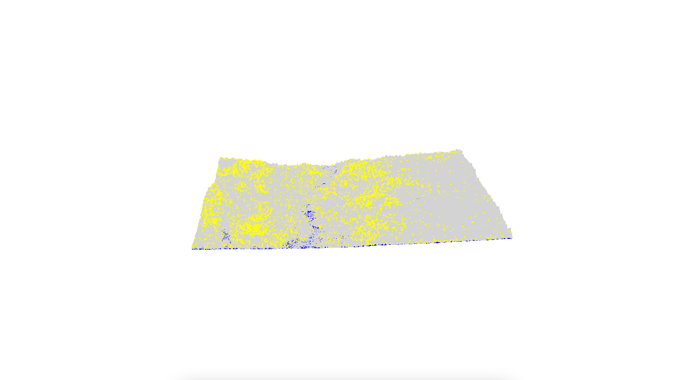
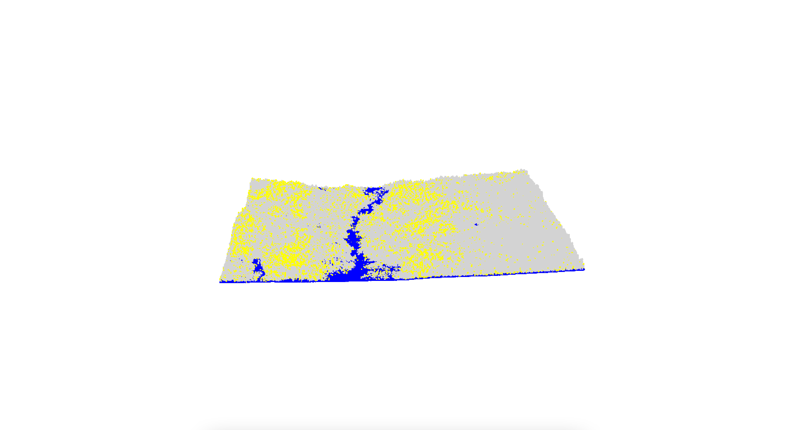
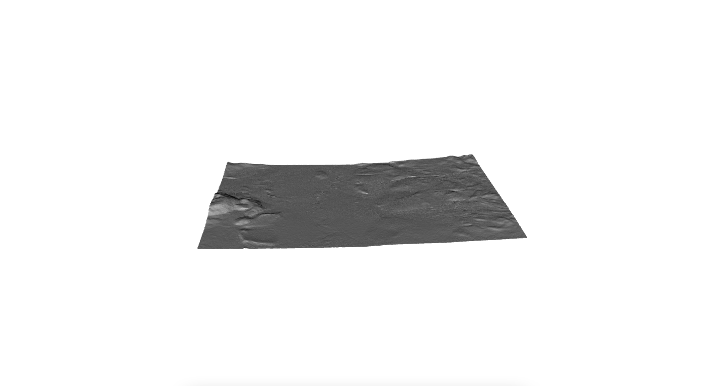
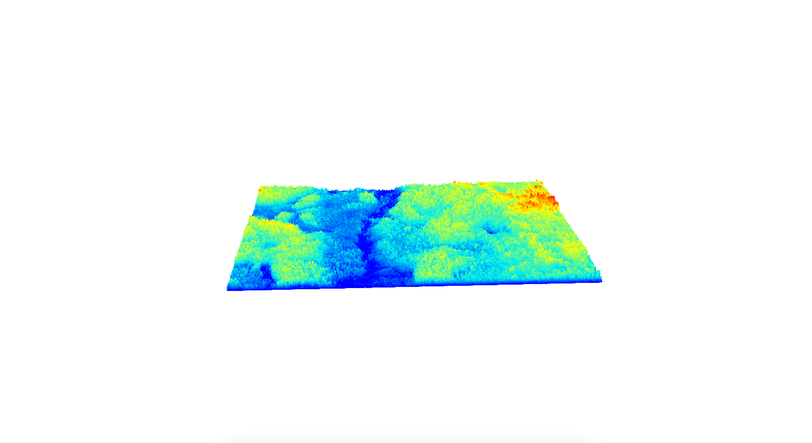
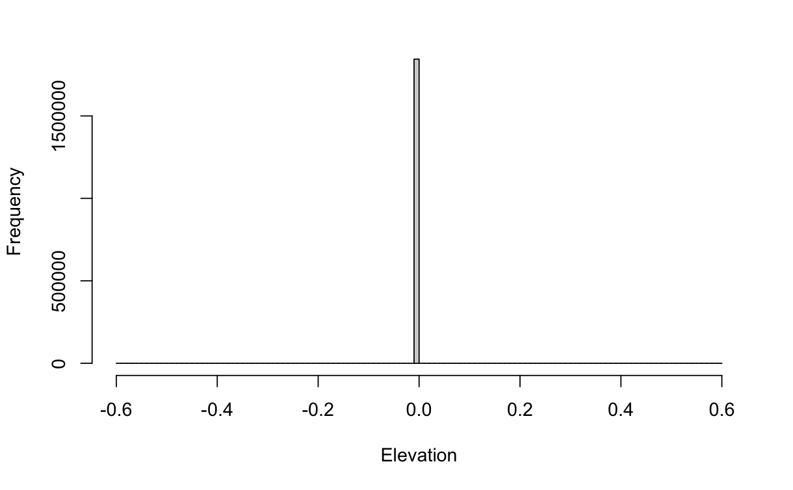
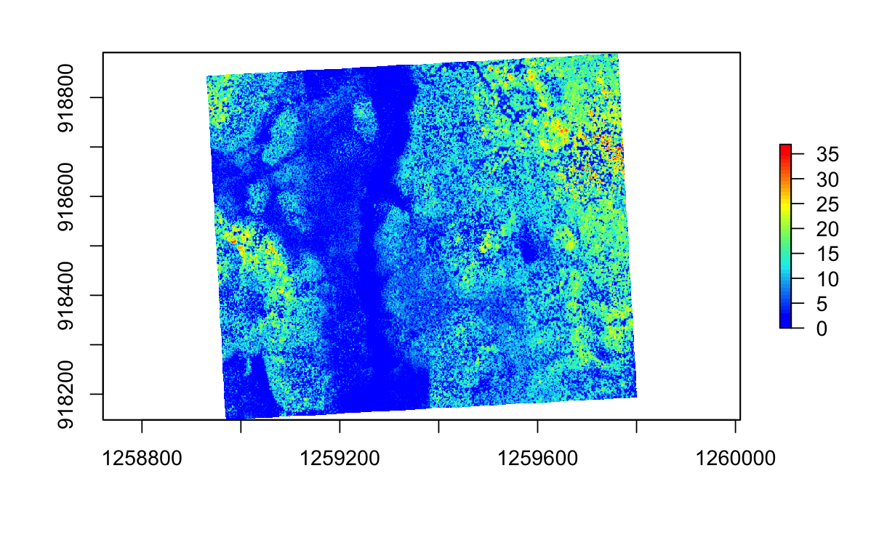

```{r setup}
#| warning: false
#| message: false
#| error: false
#| echo: false

pacman::p_load(
  "curl", 
  "dplyr",
  "fontawesome",
  "htmltools",
  "kableExtra", "knitr",
  "lidR", 
  "raster", "reproj",
  "sf",
  "terra", "tmap",
  "useful")

knitr::opts_chunk$set(
  echo = TRUE, 
  message = FALSE, 
  warning = FALSE,
  error = TRUE, 
  comment = NA)

sf::sf_use_s2(use_s2 = FALSE)
options(htmltools.dir.version = FALSE)
tmap_options(max.raster = c(plot = 9500000, view = 10000000))
```

------------------------------------------------------------------------

# Overview

Raw LiDAR data arrives as massive unclassified point clouds (.xyz, .laz format) containing ground, vegetation, buildings, and noise. This chapter documents the preprocessing pipeline: catalog management, ground classification, noise removal, DTM generation, and height normalization. Output is analysis-ready normalized point clouds for tree detection.

**Note**: Ground classification and DTM generation on large catalogs can require full-day processing times. Tiling configuration and indexing quality directly impact performance.

------------------------------------------------------------------------

## 1. Catalog Management

`LAScatalog` handles datasets too large for memory by partitioning data into chunks and processing sequentially or in parallel. Does not support overlapping tiles—filter overlaps using `withheld` attribute or `-drop_class 19`.

```{r import-catalog}
#| warning: false
#| message: false
#| error: false
#| echo: true
#| eval: false

# Read and validate LAS files, then assemble them into a LAScatalog object.
las_ctg_ahbau = readALSLAScatalog("./Data/Ahbau/Las_v12_ASPRS/", select = "xyzcr")
# A custom R function was used to handle .7z archives.
un7zip = function(archive, where) {
  archive <- normalizePath(archive)
  current_path <- setwd(where)
  system(paste("7zr x", archive, sep = " "))
  setwd(current_path)
}
un7zip(zip_file_ahbau_sub, zip_dir_ahbau_top)
# Read and validate LAS files, then assemble them into a LAScatalog object.
las_ctg_ahbau_indexed = readALSLAScatalog("./Data/Ahbau/Las_v12_ASPRS/")
opt_select(las_ctg_ahbau_indexed) = "xyzcr"
# Apply the '-drop_class 19' filter to remove overlapping points.
opt_filter(las_ctg_ahbau_indexed) = '-drop_class 19'
# Set chunking options for memory efficiency.
opt_chunk_size(las_ctg_ahbau_indexed) = 1000
opt_chunk_buffer(las_ctg_ahbau_indexed) = 10
filter_duplicates(las_ctg_ahbau_indexed)
is.indexed(las_ctg_ahbau_indexed)
las_check(las_ctg_ahbau_indexed)
plot(las_ctg_ahbau_indexed, chunk = TRUE)
```

**Key parameters**:

-   Buffer = 10m minimizes edge effects
-   Chunk size = 1000m balances memory vs. overhead
-   Filter overlaps before processing to prevent artifacts

::: {style="overflow: auto;"}
{alt="Check Check 1" style="float: left; margin-right: 2%;" width="43.5%"} {alt="Chunk Check 2" style="float: left;" width="50.2%"}
:::

{fig-align="center" width="95%"}

------------------------------------------------------------------------

## 2. Ground Classification

In this section, we compare performances of the Cloth Simulation Filter (`csf()`) with the Progressive Morphological Filter (`pmf()`). As shown below, we found the `csf()` algorithm produced much a smoother DTM product. In our review of the literature, we found similar discrepancies recorded between these algorithms. The package's developers have since responded confirming there to be a flaw in function's mathematical logic that is exposed when comparing performances in point-cloud operations. This become especially evident across variable topograpy where the `csf()` excels [@zhang2016]. As a result, the `csf()` candidate was selected and its output was passed downstream for next steps.

```{r}
#| warning: false
#| message: false
#| error: false
#| echo: true
#| eval: false

# Apply CSF
library(RCSF)
opt_output_files(
	las_ctg_ahbau_indexed) = paste0(
		tempdir(), "./Data/las_ctg_ahbau_csf")
las_ctg_ahbau_csf = classify_ground(las_ctg_ahbau_indexed, csf(sloop_smooth=TRUE, 0.5, 1))

# Apply PMF
util_makeZhangParam()
las_ctg_ahbau_pmf = classify_ground(
	las_ctg_ahbau_indexed, pmf(seq(5, 9, 13), seq(3, 3, 3)))
```

```         
## Metrics computation: [=-------------------------------------------------] 3% (1 threads)Metrics computation: [==------------------------------------------------] 4% (1 threads)Metrics computation: [==------------------------------------------------] 5% (1 threads)Metrics computation: [===-----------------------------------------------] 6% (1 threads)Metrics computation: [===-----------------------------------------------] 7% (1 threads)Metrics computation: [====----------------------------------------------] 8% (1 threads)Metrics computation: [====----------------------------------------------] 9% (1 threads)Metrics computation: [=====---------------------------------------------] 10% (1 threads)Metrics computation: [=====---------------------------------------------] 11% (1 threads)Metrics computation: [======--------------------------------------------] 12% (1 threads)Metrics computation: [======--------------------------------------------] 13% (1 threads)Metrics computation: [=======-------------------------------------------] 14% (1 threads)Metrics computation: [=======-------------------------------------------] 15% (1 threads)Metrics computation: [========------------------------------------------] 16% (1 threads)Metrics computation: [========------------------------------------------] 17% (1 threads)Metrics computation: [=========-----------------------------------------] 18% (1 threads)Metrics computation: [=========-----------------------------------------] 19% (1 threads)Metrics computation: [==========----------------------------------------] 20% (1 threads)Metrics computation: [==========----------------------------------------] 21% (1 threads)Metrics computation: [===========---------------------------------------] 22% (1 threads)Metrics computation: [===========---------------------------------------] 23% (1 threads)Metrics computation: [============--------------------------------------] 24% (1 threads)Metrics computation: [============--------------------------------------] 25% (1 threads)Metrics computation: [=============-------------------------------------] 26% (1 threads)Metrics computation: [=============-------------------------------------] 27% (1 threads)Metrics computation: [==============------------------------------------] 28% (1 threads)Metrics computation: [==============------------------------------------] 29% (1 threads)Metrics computation: [===============-----------------------------------] 30% (1 threads)Metrics computation: [===============-----------------------------------] 31% (1 threads)Metrics computation: [================----------------------------------] 32% (1 threads)Metrics computation: [================----------------------------------] 33% (1 threads)Metrics computation: [=================---------------------------------] 34% (1 threads)Metrics computation: [=================---------------------------------] 35% (1 threads)Metrics computation: [==================--------------------------------] 36% (1 threads)Metrics computation: [==================--------------------------------] 37% (1 threads)Metrics computation: [===================-------------------------------] 38% (1 threads)Metrics computation: [===================-------------------------------] 39% (1 threads)Metrics computation: [====================------------------------------] 40% (1 threads)Metrics computation: [====================------------------------------] 41% (1 threads)Metrics computation: [=====================-----------------------------] 42% (1 threads)Metrics computation: [=====================-----------------------------] 43% (1 threads)Metrics computation: [======================----------------------------] 44% (1 threads)Metrics computation: [======================----------------------------] 45% (1 threads)Metrics computation: [=======================---------------------------] 46% (1 threads)Metrics computation: [=======================---------------------------] 47% (1 threads)Metrics computation: [========================--------------------------] 48% (1 threads)Metrics computation: [========================--------------------------] 49% (1 threads)Metrics computation: [=========================-------------------------] 50% (1 threads)Metrics computation: [=========================-------------------------] 51% (1 threads)Metrics computation: [==========================------------------------] 52% (1 threads)Metrics computation: [==========================------------------------] 53% (1 threads)Metrics computation: [===========================-----------------------] 54% (1 threads)Metrics computation: [===========================-----------------------] 55% (1 threads)Metrics computation: [============================----------------------] 56% (1 threads)Metrics computation: [============================----------------------] 57% (1 threads)Metrics computation: [=============================---------------------] 58% (1 threads)Metrics computation: [=============================---------------------] 59% (1 threads)Metrics computation: [==============================--------------------] 60% (1 threads)Metrics computation: [==============================--------------------] 61% (1 threads)Metrics computation: [===============================-------------------] 62% (1 threads)Metrics computation: [===============================-------------------] 63% (1 threads)Metrics computation: [================================------------------] 64% (1 threads)Metrics computation: [================================------------------] 65% (1 threads)Metrics computation: [=================================-----------------] 66% (1 threads)Metrics computation: [=================================-----------------] 67% (1 threads)Metrics computation: [==================================----------------] 68% (1 threads)Metrics computation: [==================================----------------] 69% (1 threads)Metrics computation: [===================================---------------] 70% (1 threads)Metrics computation: [===================================---------------] 71% (1 threads)Metrics computation: [====================================--------------] 72% (1 threads)Metrics computation: [====================================--------------] 73% (1 threads)Metrics computation: [=====================================-------------] 74% (1 threads)Metrics computation: [=====================================-------------] 75% (1 threads)Metrics computation: [======================================------------] 76% (1 threads)Metrics computation: [======================================------------] 77% (1 threads)Metrics computation: [=======================================-----------] 78% (1 threads)Metrics computation: [=======================================-----------] 79% (1 threads)Metrics computation: [========================================----------] 80% (1 threads)Metrics computation: [========================================----------] 81% (1 threads)Metrics computation: [=========================================---------] 82% (1 threads)Metrics computation: [=========================================---------] 83% (1 threads)Metrics computation: [==========================================--------] 84% (1 threads)Metrics computation: [==========================================--------] 85% (1 threads)Metrics computation: [===========================================-------] 86% (1 threads)Metrics computation: [===========================================-------] 87% (1 threads)Metrics computation: [============================================------] 88% (1 threads)Metrics computation: [============================================------] 89% (1 threads)Metrics computation: [=============================================-----] 90% (1 threads)Metrics computation: [=============================================-----] 91% (1 threads)Metrics computation: [==============================================----] 92% (1 threads)Metrics computation: [==============================================----] 93% (1 threads)Metrics computation: [===============================================---] 94% (1 threads)Metrics computation: [===============================================---] 95% (1 threads)Metrics computation: [================================================--] 96% (1 threads)Metrics computation: [================================================--] 97% (1 threads)Metrics computation: [=================================================-] 98% (1 threads)Metrics computation: [=================================================-] 99% (1 threads)Metrics computation: [==================================================] 100% (1 threads)
```

------------------------------------------------------------------------

## 3. Noise Removal

Once ground points are classified, any remaining noise, such as atmospheric interference or photon noise, is identified and removed to ensure data integrity. This process was carried out using the Statistical Outlier Removal (`sor`) algorithm, which was fitted with a default neighborhood sample of `k=10` and a multiplier of `m=3`.

The workflow considered four potential methods for noise screening, including:

1.  Using internal algorithms with the `filter_poi` function and a `LASNOISE` string.
2.  Filtering with `opt_filter` and the `-drop class 19` string.
3.  Screening by a Z-axis threshold (e.g., `Z > 40 & Z < 0`).
4.  Screening by the 95th percentile.

The approach of using `filter_poi` with an internal algorithm was found to be slower in the long run due to a loss of spatial indexing after a new catalog object was assigned.

```{r}
#| warning: false
#| message: false
#| error: false
#| echo: true
#| eval: false

opt_output_files(las_ctg_ahbau_csf) = paste0(tempdir(), "./Data/las_ctg_ahbau_csf_so")
opt_select(las_ctg_ahbau_csf) = "xyzcr"
opt_filter(las_ctg_ahbau_csf) = "-drop_class 19"
las_ctg_ahbau_csf_so = classify_noise(las_ctg_ahbau_csf, sor(k=10, m=3))
las_ctg_ahbau_csf_sor = filter_poi(las_ctg_ahbau_csf_so, Classification != LASNOISE)
```

::: {style="overflow: auto;"}
{alt="Noise Removal 1" style="float: left; margin-right: 2%;" width="49%"} {alt="Noise Removal 2" style="float: left;" width="49%"}
:::

------------------------------------------------------------------------

## 4. Digital Terrain Model

This section documents an important step of rasterization. This step is empirically paramount to terrain analysis as it involves assembling the DTM layer from the dataset of classified ground points which shapes all subsequent height-based estimates. The Inverse Distance Weighting (`knnidw`) algorithm was employed for this task due to its efficiency, robustness, and known sensitivity to lake anomalies [@tu2020]. The `knnidw` parameters were set to the

-   default maximum radius of 50m,
-   a neighborhood of `10`,
-   an inverse distance weighting power of `2`,
-   and a resolution of `1m`.

```{r}
#| warning: false
#| message: false
#| error: false
#| echo: true
#| eval: false

# Single tile for validation
las_dtm = grid_terrain(las_final, res=1, knnidw(k=10, p=2, rmax=50))

# Full catalog
opt_output_files(las_final) = paste0(tempdir(), "/dtm")
las_ctg_dtm = grid_terrain(las_final, res=1, knnidw())

# Hillshade visualization
slope = terrain(las_dtm, "slope", unit="radians")
aspect = terrain(las_dtm, "aspect", unit="radians")
hillshade = hillShade(slope, aspect, angle=40, direction=270)
plot(hillshade, col=grey(0:100/100), legend=FALSE)
```

::: {style="overflow: auto;"}
{alt="DTM-1" style="float: left; margin-right: 2%;" width="49%"} {alt="DTM-2" style="float: left;" width="47.7%"}
:::

**Result**: CSF produces visually superior DTM.

------------------------------------------------------------------------

## 5. Height Normalization

Transform Z values from absolute elevation to height above ground. Essential input for all canopy analyses.

```{r normalize-height}
#| eval: false

opt_filter(las_final) = '-keep_first'
las_norm = normalize_height(las_final, knnidw())

# Validate normalization
hist(filter_ground(las_norm)$Z, 
     breaks=seq(-0.6, 0.6, 0.01), 
     main="Ground Point Heights", 
     xlab="Elevation (m)")
```

**Quality check**: Ground point histogram should center near zero. Deviations indicate DTM issues or algorithm failure in complex terrain.

::: {layout-ncol="2"}
{width="52%"} {width="357"}
:::

------------------------------------------------------------------------

## 6. Canopy Height Model

Generate wall-to-wall CHM using Delaunay triangulation (`dsmtin`). Resolution=1m, max edge=8m.

```{r chm-generation}
#| eval: false

opt_output_files(las_norm) = paste0(tempdir(), "/chm")
las_chm = grid_canopy(las_norm, res=1, dsmtin(max_edge=8))

plot(las_chm, col=height.colors(50))
```

**Output**: Continuous canopy height raster. Input for tree detection (Chapter 2) and biomass modeling (Chapter 4).

{width="100%"}

------------------------------------------------------------------------

## Performance Notes

**Catalog operations**:

-   311 tiles processed in \~24 hours (high-performance system).
-   Bottlenecks: ground classification (60%), DTM interpolation (30%), I/O overhead (10%).

**Memory management**:

-   Process chunks sequentially if RAM \< 32GB
-   Increase chunk buffer if edge artifacts visible
-   Use `opt_independent_files()` for embarrassingly parallel tasks

**Common failures**:

-   Overlapping tiles not filtered
-   double-counting - Insufficient buffer → edge artifacts in DTM
-   Poor indexing → 10x slowdown in catalog operations

------------------------------------------------------------------------

## References

::: {#refs}
:::

------------------------------------------------------------------------

## Runtime Log

```{r}
devtools::session_info()
```
