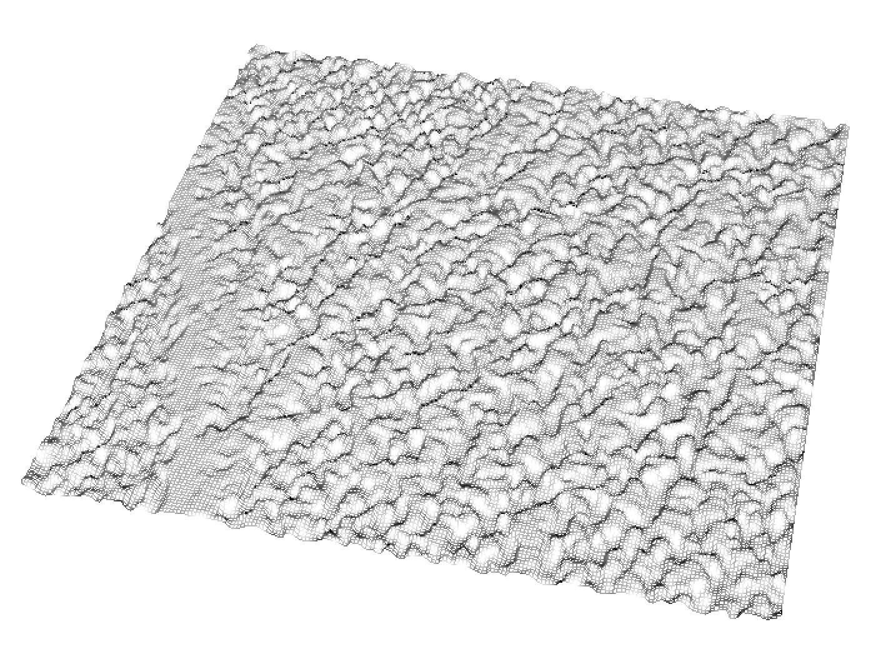
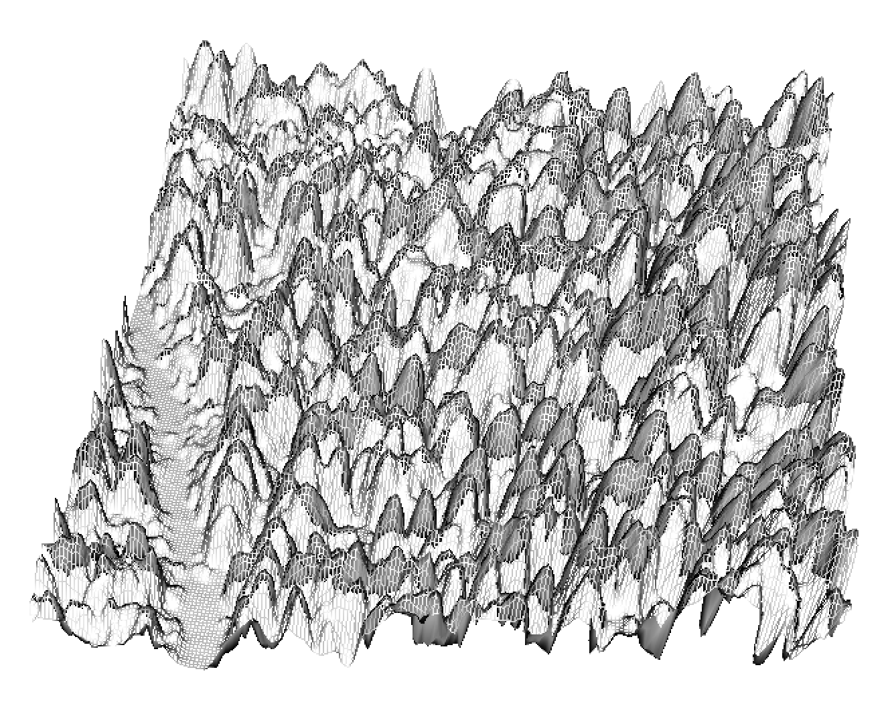

------------------------------------------------------------------------

## 4.0 Overview

LiDAR-derived metrics enable wall-to-wall biomass and volume predictions when calibrated with field inventory data. This chapter demonstrates the complete workflow: covariate preparation, species classification, masking, model training, and spatial prediction for whole stem volume per hectare (WSVHA) estimates

### Environment Setup

```{r setup}
#| warning: false
#| message: false
#| error: false
#| echo: true
pacman::p_load(
  "caret", "curl", 
  "dplyr", 
  "fontawesome",
  "htmltools", "httr2",
  "janitor",
  "kableExtra", "knitr",
  "leaflet", "lidR", "lutz", 
  "openxlsx",
  "PROJ",
  "randomForest", "raster", "rasterVis", "reproj",
  "sf",
  "tinytex", "tmap", "tmaptools", "terra",
  "useful", "usethis", 
  "webshot", "webshot2", "weathercan")
```

```{r}
#| warning: false
#| message: false
#| error: false
#| echo: false

knitr::opts_chunk$set(
  echo = TRUE, 
  message = FALSE, 
  warning = FALSE,
  error = TRUE, 
  comment = NA, 
  tidy.opts = list(
    width.cutoff = 60)
  ) 

#knit_hooks$set(webgl = hook_webgl)
#knit_hooks$set(rgl.static = hook_rgl)
sf::sf_use_s2(use_s2 = FALSE)

options(htmltools.dir.version = FALSE, 
        htmltools.preserve.raw = FALSE,
				tinytex.verbose = TRUE
				)

tmap_options(max.raster = c(plot = 9500000, view = 10000000)) # allows large raster rendering
```

```{css, echo=FALSE, class.source = 'foldable'}
div.column {
    display: inline-block;
    vertical-align: top;
    width: 50%;
}

#TOC::before {
  content: "";
  display: block;
  height:200px;
  width: 200px;
  background-image: url('https://raw.githubusercontent.com/seamusrobertmurphy/lidar-forestry/refs/heads/main/assets/PNG/stem_detect_C.png');
  background-size: contain;
  background-position: 50% 50%;
  padding-top: 1px !important;
  background-repeat: no-repeat;
}
```

------------------------------------------------------------------------

## 4.1 Spatial Covariates

### Import LiDAR

```{r}
#| eval: false
# Import & extract
las = lidR::readALSLAS("../data/las_ha.laz")
dtm = lidR::rasterize_terrain(las_sor, res = 1, algorithm = tin())
lidR::plot_dtm3d(dtm, bg = "white") 

# Save outputs

terra::writeRaster(dtm, "./data/dtm_1m.tif")
```

{fig-align="center" width="95%"}

### Terrain Covariates

Derive slope and aspect from elevation raster. Transform aspect to northness (cosine) and eastness (sine) to avoid circular variable issues.

```{r}
#| eval: false
elev = terra::rast("./data/dtm_10m.tif")
elev = terra::project(elev, "EPSG:3857")

# Derive slope and aspect
slope     = terra::terrain(elev, v = "slope", unit = "degrees", neighbors = 8)
slope_pct = base::tan(slope * pi/180) * 100 
slope_pct = terra::clamp(slope_pct, lower=0, upper=100)

aspect <- terrain(elev, v = "aspect", unit = "degrees", neighbors = 8)

# Transform aspect to linear components
asp_cos <- cos((aspect * pi) / 180)  # Northness
asp_sin <- sin((aspect * pi) / 180)  # Eastness

# Aggregate & resample 
# elev <- aggregate(elev, fact = 10, fun = mean)
slope <- resample(slope_pct, elev, method = "bilinear")
asp_cos <- resample(asp_cos, elev, method = "bilinear")
asp_sin <- resample(asp_sin, elev, method = "bilinear")

slope_matrix = matrix(c(
  0, 5, 1,    # <5%
  5, 10, 2,   # 5-10%
  10, 15, 3,  # 10-15%
  15, 20, 4,  # 15-20%
  20, 30, 5,  # 20-30%
  30, 100, 6  # 30-100% (since you clamped at 100)
), ncol=3, byrow=TRUE)
slope = terra::classify(
	slope, slope_matrix, include.lowest=TRUE)

# Visualize
levels(slope) <- data.frame(ID = 1:6,
  slope_class = c("<5%", "5-10%", "10-15%", "15-20%", "20-30%", "30-100%"))

terra::writeRaster(elev, "./data/elev_1m.tif")
terra::writeRaster(slope, "./data/slope_1m.tif")
terra::writeRaster(asp_cos, "./data/northness_1m.tif")
terra::writeRaster(asp_sin, "./data/eastness_1m.tif")

tmap::tmap_mode("plot")
tmap::tm_shape(elev) + 
  tmap::tm_raster(
    col.scale = tm_scale_continuous(values = terrain.colors(7)),
    col.legend = tm_legend(title = "Elevation (m)", reverse = T)) + 
  tmap::tm_graticules(lines = T, labels.rot = c(0, 90), lwd = 0.2) +
  tmap::tm_scalebar(position = c("LEFT", "BOTTOM"), text.size = 0.5) + 
  tmap::tm_compass(color.dark="gray60",position=c("top","left")) -> tm1_static

tmap::tm_shape(slope) + 
  tmap::tm_raster(
    col.scale = tm_scale(values = "viridis"), 
    col.legend=tm_legend(title="Slope (%)",reverse = T)) + 
  tmap::tm_graticules(lines = T, labels.rot = c(0, 90), lwd = 0.2) +
  tmap::tm_scalebar(position = c("LEFT", "BOTTOM"), text.size = 0.5) + 
  tmap::tm_compass(color.dark="gray60",position=c("top","left")) -> tm2_static

tmap::tm_shape(asp_cos) + 
  tmap::tm_raster(
    col.scale = tm_scale(values = "PiYG"), 
    col.legend=tm_legend(title="Northness",reverse = F)) + 
  tmap::tm_graticules(lines = T, labels.rot = c(0, 90), lwd = 0.2) +
  tmap::tm_scalebar(position = c("LEFT", "BOTTOM"), text.size = 0.5) + 
  tmap::tm_compass(color.dark="gray60",position=c("top","left")) -> tm3_static

tmap::tm_shape(asp_sin) + 
  tmap::tm_raster(
    col.scale = tm_scale(values = "PiYG"), 
    col.legend=tm_legend(title="Eastness",reverse = F)) + 
  tmap::tm_graticules(lines = T, labels.rot = c(0, 90), lwd = 0.2) +
  tmap::tm_scalebar(position = c("LEFT", "BOTTOM"), text.size = 0.5) + 
  tmap::tm_compass(color.dark="gray60",position=c("top","left")) -> tm4_static

tmap::tmap_arrange(tm1_static, tm2_static, tm3_static, tm4_static, nrow=2)
```

```{r}
#| echo: false
elev    = terra::rast("./data/elev_1m.tif")
slope   = terra::rast("./data/slope_1m.tif")
asp_cos = terra::rast("./data/northness_1m.tif")
asp_sin = terra::rast("./data/eastness_1m.tif")

slope_matrix = matrix(c(
  0, 5, 1,    # <5%
  5, 10, 2,   # 5-10%
  10, 15, 3,  # 10-15%
  15, 20, 4,  # 15-20%
  20, 30, 5,  # 20-30%
  30, 100, 6  # 30-100% (since you clamped at 100)
), ncol=3, byrow=TRUE)
slope = terra::classify(
	slope, slope_matrix, include.lowest=TRUE)

# Visualize
levels(slope) <- data.frame(ID = 1:6,
  slope_class = c("<5%", "5-10%", "10-15%", "15-20%", "20-30%", "30-100%"))

tmap::tmap_mode("plot")
tmap::tm_shape(elev) + 
  tmap::tm_raster(
    col.scale = tm_scale_continuous(values = terrain.colors(7)),
    col.legend = tm_legend(title = "Elevation (m)", reverse = T)) + 
  tmap::tm_graticules(lines = T, labels.rot = c(0, 90), lwd = 0.2) +
  tmap::tm_scalebar(position = c("LEFT", "BOTTOM"), text.size = 0.5) + 
  tmap::tm_compass(color.dark="gray60",position=c("top","left")) -> tm1_static

tmap::tm_shape(slope) + 
  tmap::tm_raster(
    col.scale = tm_scale(values = "viridis"), 
    col.legend=tm_legend(title="Slope (%)",reverse = T)) + 
  tmap::tm_graticules(lines = T, labels.rot = c(0, 90), lwd = 0.2) +
  tmap::tm_scalebar(position = c("LEFT", "BOTTOM"), text.size = 0.5) + 
  tmap::tm_compass(color.dark="gray60",position=c("top","left")) -> tm2_static

tmap::tm_shape(asp_cos) + 
  tmap::tm_raster(
    col.scale = tm_scale(values = "PiYG"), 
    col.legend=tm_legend(title="Northness",reverse = F)) + 
  tmap::tm_graticules(lines = T, labels.rot = c(0, 90), lwd = 0.2) +
  tmap::tm_scalebar(position = c("LEFT", "BOTTOM"), text.size = 0.5) + 
  tmap::tm_compass(color.dark="gray60",position=c("top","left")) -> tm3_static

tmap::tm_shape(asp_sin) + 
  tmap::tm_raster(
    col.scale = tm_scale(values = "PiYG"), 
    col.legend=tm_legend(title="Eastness",reverse = F)) + 
  tmap::tm_graticules(lines = T, labels.rot = c(0, 90), lwd = 0.2) +
  tmap::tm_scalebar(position = c("LEFT", "BOTTOM"), text.size = 0.5) + 
  tmap::tm_compass(color.dark="gray60",position=c("top","left")) -> tm4_static

tmap::tmap_arrange(tm1_static, tm2_static, tm3_static, tm4_static, nrow=2)
```

### Canopy Covariate

-   100x aggregation (1m → 100m) matches field plot scale
-   Mean aggregation appropriate for height metrics
-   Alternative: 95th percentile for dominant height

```{r}
#| eval: false
las_ha = lidR::readALSLAS("./data/las_ha.laz")
chm    = lidR::rasterize_canopy(las_ha, res=0.5, lidR::pitfree(subcircle=0.2))

# Hillshade visualization
slope 		= raster::terrain(chm, "slope", unit="radians") |> raster::raster()
aspect		= raster::terrain(chm, "aspect", unit="radians") |> raster::raster()
hillshade = raster::hillShade(slope, aspect, angle=40, direction=270)
lidR::plot_dtm3d(hillshade, bg = "white") 
lidR::plot_dtm3d(chm, bg = "white") 

# Apply vegetation height threshold
chm[chm < 1.3] <- NA
terra::writeRaster(chm, "./data/chm_1m.tif")
```

{alt="Check Check 1" style="float: left; margin-right: 2%;" width="49.5%"} {alt="Chunk Check 2" style="float: left;" width="46%"}

------------------------------------------------------------------------

## 4.2 Species Covariates

### VRI-Based Species Raster

```{r}
#| eval: false

# Import VRI data
#download.file(url = "https://pub.data.gov.bc.ca/datasets/02dba161-fdb7-48ae-a4bb-bd6ef017c36d/current/VEG_COMP_LYR_L1_POLY_2024.gdb.zip", destfile = "./data/vri_layers.zip", overwrite=TRUE)
#zip_file_vri = ("./data/vri_layers.zip")
#unzip(zip_file_vri, exdir="./data", overwrite = TRUE)
vri = sf::read_sf("./data/vri_1ha.gpkg") |> 
	dplyr::select(SPECIES_CD_1)

# Recode to numeric classes
vri$species <- dplyr::recode(vri$SPECIES_CD_1,
  PL = 0, PLI = 0,          				# Pine
  SB = 1, SE = 1, SW = 1, SX = 1, 	# Spruce
  FD = 2, FDI = 2,          				# Douglas-fir
  CW = 3,                   				# Western redcedar
  HW = 4,                   				# Western hemlock
  BL = 5,				                    # Subalpine fir
  LW = 6)       				          	# Western larch

# Convert to raster
vri_species	 = vri["species"]
species = terra::rasterize(
	terra::vect(vri_species), chm, 
  field = "species", 
  touches = TRUE
	)

species <- terra::resample(species, chm, method = "near")
terra::writeRaster(species, "./data/species.tif")
```

**Species coding rationale:**

-   Numeric classes enable regression models
-   Grouped by similar allometry (e.g., all spruce species)
-   Nearest-neighbor resampling method preserves categorical data

------------------------------------------------------------------------

## 4.3 Stack Covariates

```{r}
#| eval: false
elev    = terra::rast("./data/elev_1m.tif")
slope   = terra::rast("./data/slope_1m.tif")
asp_cos = terra::rast("./data/northness_1m.tif")
asp_sin = terra::rast("./data/eastness_1m.tif")
chm			= terra::rast("./data/chm_1m.tif")
species = terra::rast("./data/species.tif")

# Rename layers for model compatibility
names(elev) 		= "elev"
names(slope)  	= "slope"
names(asp_cos)  = "asp_cos"
names(asp_sin)  = "asp_sin"
names(chm)			= "chm"
names(species)	= "species"

elev		= terra::resample(elev, chm, method = "bilinear")
slope		= terra::resample(slope, chm, method = "bilinear")
asp_cos	= terra::resample(asp_cos, chm, method = "bilinear")
asp_sin	= terra::resample(asp_sin, chm, method = "bilinear")
species	= terra::resample(species, chm, method = "near")
chm			= terra::resample(chm, elev, method = "bilinear")

elev		= raster(elev)
slope 	= raster(slope)
asp_cos = raster(asp_cos)
asp_sin = raster(asp_sin)
chm			= raster(chm)
species = raster(species)

# Stack covariates
covs_stack <- raster::stack(
  elev, 
  slope, 
  asp_cos, 
  asp_sin, 
  chm, 
  species
  )

# Verify stack
names(covs_stack)
rasterVis::levelplot(covs_stack)
```

------------------------------------------------------------------------

## 4.5 Field Data Preparation

### Import and Clean PSP Data

```{r}
#| eval: false

# Import permanent sample plot data
faib_psp <- read.csv("FAIB_PSP_20211028.csv")

# Filter to utilization standard and target species
faib_psp <- subset(faib_psp, util == '12.5')
faib_psp <- subset(faib_psp, 
  spc_live1 %in% c('PL', 'PLI', 'FD', 'FDI', 
                   'SB', 'SE', 'SW', 'SX', 
                   'CW', 'HW', 'BL', 'LW'))

# Create species class variable
faib_psp$species_class <- recode(faib_psp$spc_live1,
  PL = 0, PLI = 0, 
  SB = 1, SE = 1, SX = 1, 
  FD = 2, FDI = 2, 
  CW = 3, HW = 4, BL = 5, LW = 6)

# Transform aspect
faib_psp$asp_cos <- cos((faib_psp$aspect * pi) / 180)
faib_psp$asp_sin <- sin((faib_psp$aspect * pi) / 180)
```

### Data Quality Control

```{r}
#| eval: false

# Remove problematic observations
faib_psp$elev[faib_psp$elev <= 0] <- NA
faib_psp$slope[faib_psp$slope <= 0] <- NA
faib_psp$lead_htop[faib_psp$lead_htop < 1.3] <- NA
faib_psp$wsvha_L[faib_psp$wsvha_L <= 0] <- NA

# Remove outliers (stems/ha > 864 = 3 SD above mean)
faib_psp <- subset(faib_psp, stemsha_L < 864)

# Subset to model variables
faib_vri_df <- faib_psp[c("elev", "slope", "asp_cos", "asp_sin",
                          "lead_htop", "species_class", "wsvha_L")]
faib_vri_df <- na.omit(faib_vri_df)
```

------------------------------------------------------------------------

## 4.6 Bootstrapping for Distribution Matching

Match field data distribution to raster covariate distribution to reduce prediction bias.

```{r}
#| eval: false

# Extract raster distribution
lead_htop_df <- as.data.frame(rasterToPoints(lead_htop_raster))

# Create density function for weighting
dens_fun <- approxfun(density(lead_htop_df$lead_htop, adjust = 0.8))

# Bootstrap sample
B <- 1000  # Number of bootstrap samples
n <- 4     # Sample multiplier

faib_vri_boot <- sample_n(faib_vri_df, 
                          B * n, 
                          weight_by = dens_fun(faib_vri_df$lead_htop), 
                          replace = TRUE)

# Compare distributions
par(mfrow = c(1, 2))
truehist(faib_vri_df$lead_htop, main = "Original FAIB")
truehist(faib_vri_boot$lead_htop, main = "Bootstrapped FAIB")
```

**Bootstrapping rationale:** Reduces systematic bias when field plots under-represent certain height classes present in raster data.

------------------------------------------------------------------------

## 4.7 Train-Test Split

```{r}
#| eval: false

# 80-20 split
train_split <- createDataPartition(faib_vri_boot$wsvha_L, p = 0.80, list = FALSE)

train <- faib_vri_boot[train_split, ]
test <- faib_vri_boot[-train_split, ]

# Separate predictors and response
X_train <- train[, -7]
y_train <- train[, 7]
X_test <- test[, -7]
y_test <- test[, 7]
```

------------------------------------------------------------------------

## 4.8 Model Training

### Random Forest Regression

```{r}
#| eval: false

library(e1071)
library(randomForest)
library(caret)

# Hyperparameter tuning
tuneResult_rf <- tune.randomForest(
  X_train, y_train,
  mtry = c(2:6),
  ntree = 50,
  tunecontrol = tune.control(sampling = "cross", cross = 10),
  preProcess = c('YeoJohnson', 'scale', 'center', 'corr')
)

# Extract best model
tunedModel_rf <- tuneResult_rf$best.model

# Predict on test set
rf_predictions <- predict(tunedModel_rf, X_test)

# Performance metrics
rf_mae <- MAE(rf_predictions, y_test)
rf_rmse <- RMSE(rf_predictions, y_test)
rf_r2 <- R2(rf_predictions, y_test)

cat("MAE:", round(rf_mae, 2), "m³/ha\n")
cat("RMSE:", round(rf_rmse, 2), "m³/ha\n")
cat("R²:", round(rf_r2, 3), "\n")

# Save model
save(tunedModel_rf, file = "wsvha_model_rf_bootstrapped.RData")
```

**Preprocessing transformations:**

-   `YeoJohnson`: Power transformation for skewed predictors
-   `center`: Mean-centering (subtract mean)
-   `scale`: Standardization (divide by SD)
-   `corr`: Remove highly correlated predictors (\|r\| \> 0.9)

### Support Vector Machine

```{r}
#| eval: false

# SVM with radial kernel
tuneResult_svm <- tune(svm, X_train, y_train,
  ranges = list(
    cost = c(1, 5, 7, 15, 20),
    gamma = 2^(-1:1)
  ),
  tunecontrol = tune.control(cross = 10),
  preProcess = c("YeoJohnson", "center", "scale")
)

tunedModel_svm <- tuneResult_svm$best.model

# Predict and evaluate
svm_predictions <- predict(tunedModel_svm, X_test)
svm_mae <- MAE(svm_predictions, y_test)
svm_rmse <- RMSE(svm_predictions, y_test)
svm_r2 <- R2(svm_predictions, y_test)
```

------------------------------------------------------------------------

## 4.9 Spatial Prediction

### Generate WSVHA Raster

```{r}
#| eval: false

# Predict across entire raster stack
wsvha_raster <- raster::predict(covs_stack, tunedModel_rf)

# Remove negative predictions (artifacts from extrapolation)
wsvha_raster$layer[wsvha_raster$layer <= 0] <- 0

# Export
writeRaster(wsvha_raster,
            filename = "wsvha_model1_randomForest_bootstrapped_demBased_100m_allSpeciesAreas.tif",
            overwrite = TRUE)

# Visualize
plot(wsvha_raster, 
     main = "WSVHA for All-Species Operating Areas: Random Forest",
     cex.main = 0.8,
     maxpixels = 22000000)

hist(wsvha_raster,
     main = "WSVHA Distribution: Random Forest",
     cex.main = 0.8,
     maxpixels = 22000000)
```

Negative predictions are clamped to zero. These arise when the model extrapolates beyond training data, typically in recently harvested or non-forested cells. The WSVHA raster was validated against pre-harvest cruise data at the Quesnel Lake site (see @sec-validation).

------------------------------------------------------------------------

## 4.10 Model Evaluation

### Cross-Validation Metrics

Performance metrics from 10-fold cross-validation on 5,264 FAIB permanent sample plots across the Gaspard Operating Area, BC. Two model specifications were tested: Model 1 excludes stems per hectare (`stemsha_L`); Model 2 includes it.

```{r}
#| eval: false

# Full dataset performance
rf_r2_full   <- R2(predict(tunedModel_rf, X_train), y_train)
rf_mae_full  <- MAE(predict(tunedModel_rf, X_train), y_train)
rf_rmse_full <- RMSE(predict(tunedModel_rf, X_train), y_train)

# Test set performance
rf_mae_test  <- MAE(rf_predictions, y_test)
rf_rmse_test <- RMSE(rf_predictions, y_test)

cat("Full Dataset R²:", round(rf_r2_full, 3), "\n")
cat("Full Dataset RMSE:", round(rf_rmse_full, 2), "m³/ha\n")
cat("Test Set RMSE:", round(rf_rmse_test, 2), "m³/ha\n")
```

### Operational Results

The table below reports actual performance from the [EFI model assessment pipeline](https://github.com/seamusrobertmurphy/enhanced-forest-inventory-model-assessment), run on FAIB PSP data with 80/20 train-test split and 10-fold CV. Target variable: whole stem volume per hectare (WSVHA, m³/ha).

| Model | Full RMSE | CV RMSE | Full MAE | RMSE Ratio |
|:------|----------:|--------:|---------:|-----------:|
| RF (e1071, mtry=3, ntree=50)        |  5.6 | 12.8 |  3.7 | 0.42 |
| RF (caret, mtry=3, ntree=500)       |  5.2 | ---  |  3.4 | 0.02 |
| SVM Radial (epsilon=0.02, C=20)     |  5.9 |  9.9 |  3.5 | 0.59 |
| SVM Radial (epsilon=0.10, C=20)     | 10.8 | 14.0 |  9.4 | 0.78 |
| Ensemble GLMnet (alpha=0.10)        |  --- | 13.7 |  --- | ---  |
| SVM Linear                          | 41.2 | 213  | 30.0 | 0.19 |
| GLM (caret)                         | 40.9 | 216  | 30.7 | 0.19 |

: Model comparison for WSVHA prediction (m³/ha). RMSE ratio = full-data RMSE / CV RMSE; values well below 1.0 indicate overfitting. {#tbl-model-comparison}

The RF (caret, 500 trees) achieves the lowest full-data RMSE but an RMSE ratio of 0.02, a clear sign of overfitting. The SVM Radial with tuned epsilon strikes the best balance: full RMSE of 5.9 m³/ha and CV RMSE of 9.9 m³/ha. Linear models (SVM Linear, GLM) failed entirely, with CV RMSE exceeding 200 m³/ha.

### Univariate Predictor Analysis

Simple linear regressions of each covariate against WSVHA reveal that `lead_htop` (95th percentile canopy height from LiDAR) dominates:

| Predictor | R² | Coefficient | p-value |
|:----------|---:|----------:|--------:|
| lead_htop      | 0.6508 | 20.683 | < 0.0001 |
| elev           | 0.0110 | -0.095 | < 0.0001 |
| asp_cos        | 0.0050 | 15.197 | < 0.001  |
| species_class  | 0.0025 |  6.584 | < 0.001  |
| slope          | 0.0013 | -0.517 | 0.0009   |
| asp_sin        | < 0.001|  1.535 | 0.59     |
| stemsha_L      | < 0.001| -0.001 | 0.47     |

: Univariate linear regression of each predictor against WSVHA. {#tbl-univariate}

LiDAR-derived canopy height alone explains 65% of variance in whole stem volume. All terrain and species variables contribute less than 2% individually, though they improve ensemble predictions through interaction effects.

------------------------------------------------------------------------

## 4.11 Validation Sites {#sec-validation}

### Quesnel Lake Developed Blocks

Independent validation using recently harvested blocks where pre-harvest inventory exists.

```{r}
#| eval: false

# Load validation area covariate stack (same layers, different extent)
covs_quesnel <- raster::stack("./data/covs_quesnel.tif")

# Apply model to validation area
wsvha_quesnel <- raster::predict(covs_quesnel, tunedModel_rf)
wsvha_quesnel$layer[wsvha_quesnel$layer <= 0] <- 0

# Export
writeRaster(wsvha_quesnel,
            "wsvha_model1_randomForest_bootstrapped_demBased_100m_quesnelANDdevBlocks.tif",
            overwrite = TRUE)

# Visualize
plot(wsvha_quesnel,
     main = "Quesnel WSVHA: Random Forest",
     cex.main = 0.8,
     maxpixels = 22000000)

hist(wsvha_quesnel,
     main = "Quesnel WSVHA: Random Forest",
     cex.main = 0.8,
     maxpixels = 22000000)
```

The validation compares predicted WSVHA against pre-harvest cruise data at the block level, testing for systematic bias and assessing prediction variance within homogeneous stands. Full pipeline code and results are available in the [EFI full pipeline repo](https://github.com/seamusrobertmurphy/enhanced-forest-inventory-full-pipeline).

------------------------------------------------------------------------

### Runtime Log

```{r}
devtools::session_info()
```
