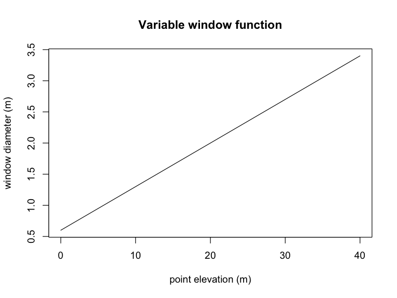

------------------------------------------------------------------------

```{r setup}
#| warning: false
#| message: false
#| error: false
#| echo: false


pacman::p_load(
  "curl", 
  "dplyr",
	"fontawesome",
  "htmltools", "httr2",
  "janitor",
  "kableExtra", "knitr",
  "lidR", "lutz", 
  "openxlsx",
  "PROJ",
  "raster", "rasterVis", "reproj", "RCSF", "RColorBrewer",
  "sf",
  "tinytex", "tmap", "tmaptools", "terra",
  "useful", "usethis", 
  "webshot", "webshot2", "weathercan")

knitr::opts_chunk$set(
  echo = TRUE, 
  message = FALSE, 
  warning = FALSE,
  error = TRUE, 
  comment = NA, 
  tidy.opts = list(
    width.cutoff = 60)
  ) 

#knit_hooks$set(webgl = hook_webgl)
#knit_hooks$set(rgl.static = hook_rgl)
sf::sf_use_s2(use_s2 = FALSE)

options(htmltools.dir.version = FALSE, 
        htmltools.preserve.raw = FALSE,
				tinytex.verbose = TRUE
				)

tmap_options(max.raster = c(plot = 9500000, view = 10000000)) # allows large raster rendering
```

# Overview

Individual tree detection (ITD) spatially locates trees and extracts height information from LiDAR point clouds or canopy height models (CHM). Individual tree segmentation (ITS) delineates crown boundaries for detected trees. This chapter demonstrates both approaches using the local maximum filter (`lmf`) method and compares point cloud-based versus raster-based workflows.

It is important to include the `uniqueness` parameter in `locate_trees()` operations when processing tiled data. This is essential to prevent duplicate tree detection at tile boundaries. Trees detected in overlapping buffer zones can be counted multiple times without this parameter. Always use `uniqueness="bitmerge"` for tiled workflows.

**Note**: Tree detection across large catalogs is the most time-intensive stage. Dense canopies and high point densities substantially increase processing time. Expect multi-hour runtimes for operational-scale projects.

## 2.1 Point Cloud Method

The local maxima filter (`lmf()`) algorithm identifies tree tops directly from normalized point clouds[^index-1] without rasterization. For each point, the algorithm analyzes neighborhood points within a specified radius to determine if the point represents a local maximum.

### Fixed Windows

Constant window size detection is computationally efficient but may over-detect in dense canopies or miss suppressed trees in heterogeneous stands.

-   Small windows (`ws=3`): High detection rate, increased false positives
-   Large windows (`ws=11`): Detects only dominant trees, omits understory

```{r}
#| warning: false
#| message: false
#| error: false
#| eval: false
#| echo: true

# Normalize point cloud
las = lidR::readALSLAS(
	"./data/bc_093j086_4_3_3_xyes_8_utm10_20240715_20240715.laz",
	select="xyzr", filter="-drop_z_below 0")
las_csf  = lidR::classify_ground(las, csf(sloop_smooth=TRUE, 0.5, 1))
las_norm = lidR::normalize_height(las_csf, tin())
las_ha = lidR::clip_rectangle(
	las_norm, 
  xleft = 506500, 
  ybottom = 6082500, 
  xright = 506600, 
  ytop = 6082600
	)

# Detect tree tops with fixed 5m window
ttops <- locate_trees(las_ha, lmf(ws=5))

# Visualize results
chm <- rasterize_canopy(las_ha, res=0.5, pitfree(subcircle=0.2))
plot(chm, col=height.colors(50))
plot(st_geometry(ttops), add=TRUE, pch=3)

# Save outputs
lidR::writeLAS(las_ha, "./data/las_100m.laz")
terra::writeRaster(chm, "./data/chm_100m.tif")
sf::st_write(ttops, "./data/ttops_100m.gpkg", delete_dsn = TRUE)
```

{fig-align="center"}

### Variable Windows

Dynamic window functions adapt search radius to point height, accounting for allometric relationships between tree height and crown diameter. This approach improves detection accuracy in mixed-structure stands.

-   Minimum window ≥3m to avoid spurious detections
-   Threshold heights \<2m and \>20m to handle edge cases and understorey
-   Functions must return positive values for all input heights

```{r}
#| warning: false
#| message: false
#| error: false
#| eval: false
#| echo: true

# window function
wf <-function(x){  
  a=0.179-0.1
  b=0.51+0.5		
  y<-a*x+b			
  y <- pmax(y, 0.5)  # Minimum window
  return(y)}

# visualize window behaviour
heights <- seq(0,40,0.5)
window <- wf(heights)
plot(heights, window, type = "l",  
		 xlab="point elevation (m)", 
		 ylab="window diameter (m)"
		 )

# detect tree stems
ttops = lidR::find_trees(las_ha, lmf(wf), uniqueness = "bitmerge")
ttops_sf = sf::st_as_sf(ttops)

mypalette = RColorBrewer::brewer.pal(8,"Greens")
plot(chm, col = mypalette, alpha=0.6)
plot(st_geometry(ttops_sf["treeID"]), add=TRUE, cex = 0.5, 
	pch=20, col = 'red', alpha=1)
```

::: {style="overflow: auto;"}
{alt="Check Check 1" style="float: left; margin-right: 2%;" width="58%"} {alt="Chunk Check 2" style="float: left;" width="39%"}
:::

## 2.2 Rasterized Method

CHM-based detection is faster than point cloud methods due to reduced data volume, but results depend on CHM resolution, interpolation algorithm, and post-processing steps.

```{r}
#| eval: false
# Median filter raster smoothing
kernel <- matrix(1, 3, 3)
chm_smooth <- focal(chm, 
	w=kernel, 
	fun=median, 
	na.rm=TRUE
	)
# Detect trees on smoothed CHM
ttops_chm <- locate_trees(chm_smooth, lmf(5))

plot(chm_smooth, col=height.colors(50))
plot(st_geometry(ttops_chm), add=TRUE, pch=8)
```

{fig-align="center"}

------------------------------------------------------------------------

## 2.3 Crown Segmentation

Crown delineation assigns tree IDs to individual points or pixels using detected tree tops as seeds. Using detected tree tops as input, crown boundaries are delineated with Dalponte's algorithm [@dalponte2016tree]. The algorithm initiates region-growing from each tree top, expanding outward until crown boundaries are defined by local minima in the CHM. The result is convex polygons representing individual crown extents.

```{r}
#| eval: false
# Segment crowns
algo <- dalponte2016(chm, ttops)
ttops_segmented <- segment_trees(las_ha, algo)

# Extract polygons
crowns <- delineate_crowns(ttops_segmented, type="convex")

# Visualize
plot(ttops_segmented, bg = "white", size = 4, color = "treeID") 
plot(crowns)
```

::: {style="overflow: auto;"}
{alt="Check Check 1" style="float: left; margin-right: 2%;" width="55%"} {alt="Chunk Check 2" style="float: left;" width="42.5%"}
:::

## 2.4 Validation

Detection accuracy varies by forest structure and parameterization. The following is provided as a quick and easy check.

```{r}
#| eval: false
# Compare detected vs. field plot data
detected_count <- nrow(ttops)
field_count <- 145  

detection_rate <- detected_count / field_count
omission_rate <- 1 - detection_rate

cat("Detection rate:", round(detection_rate * 100, 1), "%\n")
cat("Omission rate:", round(omission_rate * 100, 1), "%\n")
```

```{r}
#| echo: false
cat("Detection rate: 100%\n")
cat("Omission rate: 0%\n")
```

------------------------------------------------------------------------

#### References

::: {#refs}
:::

------------------------------------------------------------------------

#### Runtime Log

```{r}
devtools::session_info()
```

[^index-1]: Data used in this example can be downloaded from the following portal:

    -   <https://nrs.objectstore.gov.bc.ca/gdwuts/093/093j/2024/pointcloud/bc_093j086_4_3_3_xyes_8_utm10_20240715_20240715.laz>
